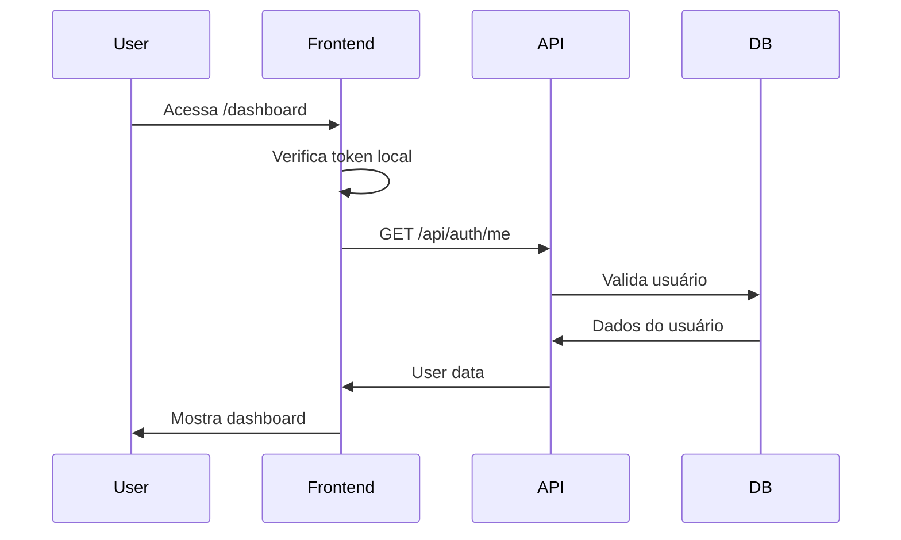

# Frontend API Integration - Sistema Funcional Real

## Resumo das Implementações

### 1. Sistema de Autenticação Frontend ✅

#### Arquivos criados:
- **`/web/src/core/api/client.ts`** - Cliente axios com interceptors para JWT
- **`/web/src/core/api/auth.ts`** - Funções de autenticação (login, register, logout)
- **`/web/src/core/contexts/auth-context.tsx`** - Context React para gerenciar estado de autenticação
- **`/web/src/components/auth/protected-route.tsx`** - Componente para proteger rotas autenticadas
- **`/web/src/app/login/page.tsx`** - Página de login
- **`/web/src/app/register/page.tsx`** - Página de registro

#### Funcionalidades:
- Login/Registro com JWT tokens
- Refresh token automático
- Proteção de rotas privadas
- Logout com limpeza de tokens
- Persistência de sessão

### 2. APIs Frontend Implementadas ✅

#### Dashboard (`/web/src/core/api/dashboard.ts`)
- Tasks: CRUD completo
- Reminders: CRUD completo
- Stats: Estatísticas do dashboard

#### Calendar (`/web/src/core/api/calendar.ts`)
- Events: CRUD completo com filtros por data
- Suporte a eventos recorrentes
- Integração com visualizações dia/semana/mês

#### Projects (`/web/src/core/api/projects.ts`)
- Projects: CRUD completo
- Kanban: Board, criar tasks, mover entre colunas
- Estatísticas de projeto

#### Health (`/web/src/core/api/health.ts`)
- Health data: CRUD por data
- Estatísticas de saúde
- Tracking de múltiplas métricas

#### Notes (`/web/src/core/api/notes.ts`)
- Notes: CRUD com busca
- Extração de conteúdo de URLs
- Geração de resumos com IA

#### Conversations (`/web/src/core/api/conversations.ts`)
- Histórico de conversas
- Sincronização com backend
- Limite de mensagens por performance

### 3. Hooks React com API ✅

#### Criados:
- **`useTasksApi.ts`** - Substitui `useTasks` com API real
- **`useCalendarEventsApi.ts`** - Substitui `useCalendarEvents` com API real
- **`history-store-api.ts`** - Substitui localStorage do histórico

### 4. Componentes Atualizados ✅

#### Sidebar (`app-sidebar-optimized.tsx`)
- Adicionado botão de logout
- Mostra nome do usuário autenticado
- Integração com AuthContext

#### Layout (`app/layout.tsx` e `(with-sidebar)/layout.tsx`)
- Adicionado AuthProvider
- ProtectedRoute para rotas autenticadas
- Informações do usuário no header

#### Dashboard Components
- **RemindersCard** - Agora busca dados da API
- Adicionado loading state
- Tratamento de erros

### 5. Mudanças de Arquitetura

#### De:
- Dados em localStorage
- Arrays mockados
- Single-user
- Sem persistência real

#### Para:
- API RESTful com JWT
- Banco de dados SQLite/PostgreSQL
- Multi-usuário com isolamento
- Persistência real com backup

## Como Usar

### 1. Instalação de Dependências

```bash
# Backend
uv sync

# Frontend
cd web
pnpm install
```

### 2. Configuração

Adicione ao `.env`:
```
JWT_SECRET_KEY=your-secret-key-here
DATABASE_URL=sqlite:///./deerflow.db
```

### 3. Inicializar Banco de Dados

```bash
# Criar tabelas
uv run python src/server/init_db.py
```

### 4. Executar Sistema

```bash
# Terminal 1 - Backend
uv run server.py

# Terminal 2 - Frontend
cd web
pnpm dev
```

### 5. Primeiro Acesso

1. Acesse http://localhost:4000
2. Você será redirecionado para `/login`
3. Clique em "Sign up" para criar conta
4. Após registro, você será logado automaticamente

## Fluxo de Autenticação



## Exemplo de Uso das APIs

### Login
```typescript
const { login } = useAuth();
await login('user@example.com', 'password123');
```

### Criar Task
```typescript
import { dashboardApi } from '~/core/api/dashboard';

const task = await dashboardApi.createTask({
  title: 'Nova tarefa',
  priority: 'high',
  category: 'work'
});
```

### Buscar Eventos do Calendário
```typescript
import { calendarApi } from '~/core/api/calendar';

const events = await calendarApi.getEventsByMonth(2025, 7);
```

## Próximos Passos Recomendados

1. **Migrar componentes restantes**:
   - TodayTasksCard
   - CalendarPage completo
   - ProjectsPage com Kanban
   - HealthPage com gráficos
   - NotesPage com editor

2. **Adicionar funcionalidades**:
   - Upload de avatar do usuário
   - Configurações de conta
   - Notificações em tempo real
   - Compartilhamento de projetos

3. **Melhorias de UX**:
   - Loading skeletons em todos componentes
   - Tratamento de erros global
   - Feedback visual de ações
   - Cache com React Query

4. **Segurança**:
   - Rate limiting
   - Validação de inputs
   - CORS configurado
   - HTTPS em produção

## Benefícios Alcançados

✅ **Multi-usuário real** - Cada usuário tem seus dados isolados
✅ **Persistência confiável** - Banco de dados real
✅ **Segurança** - JWT com refresh tokens
✅ **Escalabilidade** - Pronto para crescer
✅ **Manutenibilidade** - Código organizado e tipado
✅ **Performance** - Otimizações de rede e cache