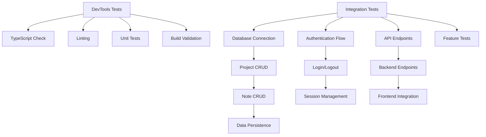

# Design: Complete Integration Tests - Neon + Clerk

## 1. Architecture Overview
### 1.1 Test Strategy


### 1.2 Test Categories
1. **DevTools Tests** (Automated)
   - TypeScript compilation
   - ESLint/Prettier
   - Unit tests
   - Build validation

2. **Integration Tests** (Manual + Automated)
   - Database connectivity
   - Authentication flows
   - CRUD operations
   - Feature workflows

3. **End-to-End Tests** (Manual)
   - Complete user journeys
   - Data persistence
   - Error scenarios

## 2. Test Plan

### 2.1 DevTools Tests
```bash
# TypeScript type checking
pnpm typecheck

# Linting
pnpm lint

# Unit tests
pnpm test

# Build validation
pnpm build

# Frontend build
cd web && pnpm build
```

### 2.2 Database Tests
```bash
# Test Neon connection
python3 -c "from src.config import load_config; cfg = load_config(); print(f'✅ Database URL: {cfg.database.url}')"

# Test database schema
python3 -c "from src.db import engine; from sqlalchemy import inspect; inspector = inspect(engine); print(f'Tables: {inspector.get_table_names()}')"

# Test basic query
python3 -c "from src.db import SessionLocal; db = SessionLocal(); result = db.execute('SELECT 1'); print(f'✅ Query result: {result.scalar()}')"
```

### 2.3 Authentication Tests
```bash
# Test Clerk configuration
python3 -c "from src.config import load_config; cfg = load_config(); print(f'✅ Clerk configured: {bool(cfg.auth.clerk_secret_key)}')"

# Test JWT secret
python3 -c "from src.config import load_config; cfg = load_config(); print(f'✅ JWT Secret length: {len(cfg.auth.jwt_secret_key)} chars')"
```

### 2.4 Feature Tests
```bash
# Create project
curl -X POST http://localhost:8005/api/projects \
  -H "Content-Type: application/json" \
  -H "Authorization: Bearer <token>" \
  -d '{"name": "Test Project", "description": "Test"}'

# Create note
curl -X POST http://localhost:8005/api/notes \
  -H "Content-Type: application/json" \
  -H "Authorization: Bearer <token>" \
  -d '{"title": "Test Note", "content": "Test content", "project_id": 1}'

# Retrieve notes
curl -X GET http://localhost:8005/api/notes \
  -H "Authorization: Bearer <token>"
```

## 3. Test Execution Flow

### Phase 1: DevTools Validation
1. Run TypeScript type checking
2. Run linting
3. Run unit tests
4. Run build validation

### Phase 2: Backend Tests
1. Verify database connection
2. Check database schema
3. Test basic queries
4. Verify Clerk configuration

### Phase 3: Integration Tests
1. Start backend server
2. Start frontend dev server
3. Test authentication flow
4. Test project creation
5. Test note creation
6. Test data retrieval

### Phase 4: End-to-End Tests
1. Manual user journey testing
2. Data persistence validation
3. Error scenario testing

## 4. Success Criteria
- All DevTools tests pass
- Database connection successful
- All CRUD operations work
- Authentication flows work
- Projects can be created
- Notes can be created and retrieved
- Data persists across sessions

## 5. Rollback Strategy
- If tests fail, identify root cause
- Check logs for errors
- Verify configuration
- Revert changes if necessary