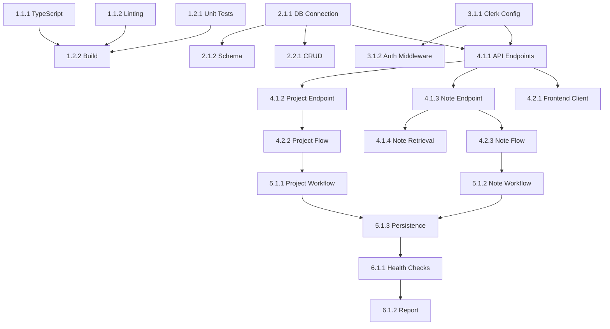

# Tasks: Complete Integration Tests - Neon + Clerk

## Phase 1: DevTools Tests
### 1.1 TypeScript and Linting
- **Task 1.1.1**: Run TypeScript type checking
  - Agent: Claude
  - Priority: High
  - Dependencies: None
  - Files: Entire codebase
  - Acceptance: TypeScript compilation succeeds with no errors
  - Requirements: FR-14

- **Task 1.1.2**: Run ESLint and code quality checks
  - Agent: Claude
  - Priority: High
  - Dependencies: None
  - Files: Entire codebase
  - Acceptance: No linting errors or warnings
  - Requirements: FR-15

### 1.2 Unit and Build Tests
- **Task 1.2.1**: Run unit tests
  - Agent: Claude
  - Priority: High
  - Dependencies: None
  - Files: tests/ directory
  - Acceptance: All unit tests pass
  - Requirements: FR-16

- **Task 1.2.2**: Run build validation
  - Agent: Claude
  - Priority: High
  - Dependencies: Task 1.1.1, Task 1.1.2
  - Files: Backend and frontend build
  - Acceptance: Build succeeds without errors
  - Requirements: FR-17

## Phase 2: Database Tests
### 2.1 Connection and Schema
- **Task 2.1.1**: Test Neon PostgreSQL connection
  - Agent: Claude
  - Priority: High
  - Dependencies: None
  - Files: src/config/configuration.py, src/db.py
  - Acceptance: Database connection successful, can execute queries
  - Requirements: FR-1, FR-2

- **Task 2.1.2**: Verify database schema and tables
  - Agent: Claude
  - Priority: High
  - Dependencies: Task 2.1.1
  - Files: Database schema
  - Acceptance: All required tables exist and have correct structure
  - Requirements: FR-2, FR-3

### 2.2 CRUD Operations
- **Task 2.2.1**: Test basic database CRUD operations
  - Agent: Claude
  - Priority: High
  - Dependencies: Task 2.1.1
  - Files: src/db.py, src/models/
  - Acceptance: Create, Read, Update, Delete operations work correctly
  - Requirements: FR-3

## Phase 3: Authentication Tests
### 3.1 Clerk Configuration
- **Task 3.1.1**: Verify Clerk authentication configuration
  - Agent: Claude
  - Priority: High
  - Dependencies: None
  - Files: src/config/configuration.py, src/server/auth.py
  - Acceptance: Clerk configuration is valid and accessible
  - Requirements: FR-4, FR-5

- **Task 3.1.2**: Test authentication middleware
  - Agent: Claude
  - Priority: High
  - Dependencies: Task 3.1.1
  - Files: src/server/auth.py, src/server/middleware.py
  - Acceptance: Authentication middleware works correctly
  - Requirements: FR-5, FR-6

## Phase 4: API Integration Tests
### 4.1 Backend Endpoints
- **Task 4.1.1**: Test backend API endpoints
  - Agent: Claude
  - Priority: High
  - Dependencies: Task 2.1.1, Task 3.1.1
  - Files: src/server/routes/
  - Acceptance: All API endpoints respond correctly
  - Requirements: FR-11

- **Task 4.1.2**: Test project creation endpoint
  - Agent: Claude
  - Priority: High
  - Dependencies: Task 4.1.1
  - Files: src/server/routes/projects.py
  - Acceptance: Project creation endpoint works, data saved to database
  - Requirements: FR-7, FR-11

- **Task 4.1.3**: Test note creation endpoint
  - Agent: Claude
  - Priority: High
  - Dependencies: Task 4.1.1
  - Files: src/server/routes/notes.py
  - Acceptance: Note creation endpoint works, data saved to database
  - Requirements: FR-8, FR-11

- **Task 4.1.4**: Test note retrieval endpoint
  - Agent: Claude
  - Priority: High
  - Dependencies: Task 4.1.3
  - Files: src/server/routes/notes.py
  - Acceptance: Note retrieval returns correct data
  - Requirements: FR-9, FR-11

### 4.2 Frontend Integration
- **Task 4.2.1**: Test frontend API client integration
  - Agent: Claude
  - Priority: High
  - Dependencies: Task 4.1.1
  - Files: web/src/services/api.ts, web/src/lib/api-client.ts
  - Acceptance: Frontend can communicate with backend API
  - Requirements: FR-12

- **Task 4.2.2**: Test frontend project creation flow
  - Agent: Claude
  - Priority: High
  - Dependencies: Task 4.2.1, Task 4.1.2
  - Files: web/src/components/, web/src/pages/
  - Acceptance: Frontend can create projects and display them
  - Requirements: FR-7, FR-12

- **Task 4.2.3**: Test frontend note creation flow
  - Agent: Claude
  - Priority: High
  - Dependencies: Task 4.2.1, Task 4.1.3
  - Files: web/src/components/, web/src/pages/
  - Acceptance: Frontend can create notes and display them
  - Requirements: FR-8, FR-9, FR-12

## Phase 5: Feature Tests
### 5.1 Complete Workflows
- **Task 5.1.1**: Test complete project creation workflow
  - Agent: Claude
  - Priority: High
  - Dependencies: Task 4.2.2
  - Files: Entire application
  - Acceptance: User can create project from UI, data persists in database
  - Requirements: FR-7, FR-10

- **Task 5.1.2**: Test complete note creation workflow
  - Agent: Claude
  - Priority: High
  - Dependencies: Task 4.2.3
  - Files: Entire application
  - Acceptance: User can create note from UI, data persists in database
  - Requirements: FR-8, FR-9, FR-10

- **Task 5.1.3**: Test data persistence across sessions
  - Agent: Claude
  - Priority: High
  - Dependencies: Task 5.1.1, Task 5.1.2
  - Files: Entire application
  - Acceptance: Data created in one session is retrievable in another
  - Requirements: FR-10

## Phase 6: Final Validation
### 6.1 Health Checks
- **Task 6.1.1**: Run comprehensive health checks
  - Agent: Claude
  - Priority: High
  - Dependencies: All previous tasks
  - Files: Entire application
  - Acceptance: All systems are healthy and operational
  - Requirements: All FR requirements

- **Task 6.1.2**: Generate test report
  - Agent: Claude
  - Priority: High
  - Dependencies: Task 6.1.1
  - Files: Test results
  - Acceptance: Comprehensive report generated with all test results
  - Requirements: All FR requirements

## Dependencies Graph

## Total Tasks: 17
**Estimated Time**: 2-3 hours
**Success Metrics**: All tests pass, all features working correctly