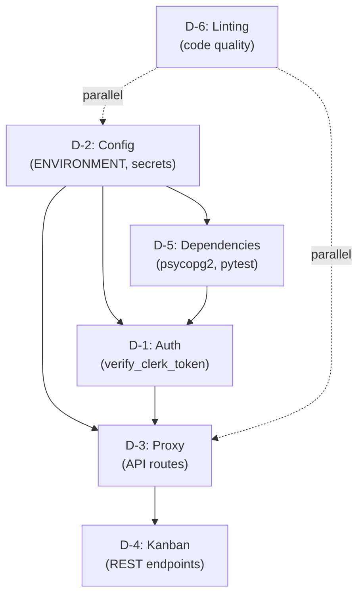

# Design: Correções e Melhorias DeerFlow

## Visão Geral Arquitetural

O DeerFlow é uma aplicação de multi-agentes baseada em LLM com arquitetura em camadas:
- **Frontend:** Next.js 14+ com TypeScript/React (web/)
- **Backend:** Python com LangGraph, FastAPI, PostgreSQL, Supabase
- **Auth:** Clerk SSO
- **Cache:** Redis
- **External APIs:** OpenRouter LLM, Jina crawling, Google Gemini TTS

As correções abordam 3 camadas: segurança (auth), configuração (env), e qualidade de código (linting/deps).

---

## D-1: Hardening de Autenticação

### Mudanças Arquiteturais

#### Backend (Python)
**Arquivo:** `src/server/auth.py`

```python
# Estrutura proposta:
class AuthConfig:
    - ENVIRONMENT: str = Field(default="production", pattern="^(development|staging|production)$")
    - JWT_SECRET_KEY: str = Field(min_length=32, description="Must be ≥32 chars")
    - CLERK_WEBHOOK_SECRET: str
    
class AuthService:
    - verify_clerk_token(token: str) -> ClerkUser  # Add explicit verification
    - validate_jwt(token: str) -> dict
    - get_current_user() -> UserResponse  # Unified schema
```

**Mudanças:**
1. Adicionar `from pydantic import Field, validator`
2. Validação de ENVIRONMENT no startup (não usar 'dev' em produção)
3. Implementar `verify_clerk_token()` com retry logic
4. Unificar `UserResponse` schema entre auth.py e frontend

**Fluxo:**
```
Client Request → Middleware (extract JWT) → verify_clerk_token() 
→ get_current_user() → UserResponse (serialized) → Route handler
```

#### Frontend (TypeScript)
**Arquivo:** `web/src/core/api/hooks.ts`

```typescript
// Adicionar:
export const useAuth = () => {
  const { user, isLoaded } = useUser(); // Clerk hook
  
  useEffect(() => {
    if (isLoaded && !user) {
      // Clear local state if user invalidated
      clearAuthState();
    }
  }, [isLoaded, user]);
  
  return { user, isLoaded };
};

// Interceptor para requests:
client.interceptors.response.use(
  (response) => response,
  (error) => {
    if (error.response?.status === 401) {
      handleAuthError(); // Redirect to login
    }
    return Promise.reject(error);
  }
);
```

**Mudanças:**
1. Adicionar retry logic com exponential backoff
2. Sincronizar UserResponse com backend
3. Clear cache on auth errors
4. Add unit tests para useAuth hook

### Validação
- Unit tests: `pytest src/server/test_auth.py` (≥80% coverage)
- E2E tests com Clerk sandbox
- Token expiration scenarios

---

## D-2: Configuração Centralizada

### Arquitetura de Configuração

```
env → .env (local) OR env vars (production)
  ↓
src/config/configuration.py (Pydantic BaseSettings)
  ↓
Config singleton
  ↓
Backend app.py, Frontend .env.js
```

### Backend Python
**Arquivo:** `src/config/configuration.py` (novo/refatorado)

```python
from pydantic_settings import BaseSettings
from typing import Optional

class DatabaseConfig(BaseSettings):
    DATABASE_URL: str
    ECHO_SQL: bool = False

class RedisConfig(BaseSettings):
    REDIS_URL: str = "redis://localhost:6379/0"
    REDIS_ENABLED: bool = True  # Optional fallback

class AuthConfig(BaseSettings):
    JWT_SECRET_KEY: str  # Mandatory, validated ≥32 chars
    ENVIRONMENT: str = Field(default="production", ...)
    CLERK_WEBHOOK_SECRET: str
    
class SupabaseConfig(BaseSettings):
    SUPABASE_URL: str
    SUPABASE_SERVICE_ROLE_KEY: str  # Mandatory
    
class AppConfig(BaseSettings):
    debug: bool = Field(default=False, env="DEBUG")
    database: DatabaseConfig
    redis: RedisConfig
    auth: AuthConfig
    supabase: SupabaseConfig
    
    @validator("auth")
    def validate_auth(cls, v):
        if len(v.JWT_SECRET_KEY) < 32:
            raise ValueError("JWT_SECRET_KEY must be ≥32 characters")
        return v

# Usage:
config = AppConfig()
app = FastAPI()
```

**Mudanças:**
1. Consolidar ENVIRONMENT vs NODE_ENV → usar `ENVIRONMENT` canonicamente
2. Adicionar validação de startup com early fail
3. Criar `conf.example.yaml` como template
4. Redis URL documentado com opção de disable

### Frontend TypeScript
**Arquivo:** `web/src/core/config/index.ts` (novo)

```typescript
export const CONFIG = {
  ENVIRONMENT: process.env.NEXT_PUBLIC_ENVIRONMENT || "production",
  API_BASE_URL: process.env.NEXT_PUBLIC_API_URL || "/api",
  CLERK_PUBLIC_KEY: process.env.NEXT_PUBLIC_CLERK_PUBLISHABLE_KEY || "",
};

// Validation at build time:
if (!CONFIG.CLERK_PUBLIC_KEY) {
  throw new Error("NEXT_PUBLIC_CLERK_PUBLISHABLE_KEY is required");
}
```

**Mudanças:**
1. Usar NEXT_PUBLIC_ENVIRONMENT (não NODE_ENV)
2. Centralizar env vars em um lugar
3. Validation at build time (next.config.js)

### Arquivos de Configuração
- **conf.example.yaml** (novo template)
- **.env.example** (completo com comentários)
- **README.md** (seção "Environment Variables")
- **ENV_VARIABLES_NEEDED.md** (matriz de obrigatoriedade)

---

## D-3: Correção do Proxy Next.js

### Problema Atual
`web/src/app/api/[...path]/route.ts` faz proxy de requisições para backend Python.

**Issues:**
- Console logs vazando requests/responses
- Erro handling inadequado
- Headers não propagados corretamente

### Solução Proposta

```typescript
// web/src/app/api/[...path]/route.ts

import { NextRequest, NextResponse } from "next/server";

const API_BASE = process.env.NEXT_PUBLIC_API_URL || "http://localhost:8000";
const DEBUG = process.env.DEBUG === "true";

async function proxyRequest(
  method: string,
  pathname: string,
  request: NextRequest
) {
  const url = new URL(`${API_BASE}${pathname}`);
  
  // Copy query params
  request.nextUrl.searchParams.forEach((value, key) => {
    url.searchParams.append(key, value);
  });
  
  const headers = new Headers();
  
  // Propagate auth headers
  const authHeader = request.headers.get("authorization");
  if (authHeader) {
    headers.set("authorization", authHeader);
  }
  
  // Propagate content-type
  const contentType = request.headers.get("content-type");
  if (contentType) {
    headers.set("content-type", contentType);
  }
  
  try {
    const body = method !== "GET" ? await request.text() : undefined;
    
    if (DEBUG) {
      console.log(`[API Proxy] ${method} ${pathname}`);
    }
    
    const response = await fetch(url.toString(), {
      method,
      headers,
      body,
    });
    
    // Copy response headers
    const responseHeaders = new Headers();
    response.headers.forEach((value, key) => {
      if (!["content-encoding"].includes(key.toLowerCase())) {
        responseHeaders.set(key, value);
      }
    });
    
    const data = await response.text();
    
    return new NextResponse(data, {
      status: response.status,
      headers: responseHeaders,
    });
  } catch (error) {
    if (DEBUG) {
      console.error(`[API Proxy Error] ${method} ${pathname}`, error);
    }
    
    return NextResponse.json(
      { error: "Internal Server Error" },
      { status: 500 }
    );
  }
}

export async function GET(
  request: NextRequest,
  { params }: { params: { path: string[] } }
) {
  const pathname = "/" + (params.path?.join("/") || "");
  return proxyRequest("GET", pathname, request);
}

export async function POST(
  request: NextRequest,
  { params }: { params: { path: string[] } }
) {
  const pathname = "/" + (params.path?.join("/") || "");
  return proxyRequest("POST", pathname, request);
}

export async function PUT(
  request: NextRequest,
  { params }: { params: { path: string[] } }
) {
  const pathname = "/" + (params.path?.join("/") || "");
  return proxyRequest("PUT", pathname, request);
}

export async function DELETE(
  request: NextRequest,
  { params }: { params: { path: string[] } }
) {
  const pathname = "/" + (params.path?.join("/") || "");
  return proxyRequest("DELETE", pathname, request);
}
```

**Mudanças:**
1. Remover console.log sempre ativo
2. Adicionar DEBUG flag condicional
3. Melhorar header propagation
4. Melhorar error handling

---

## D-4: Alinhamento de Modelos Kanban

### Estrutura de Dados
**Frontend Models:** `web/src/components/jarvis/kanban/lib/types.ts`

```typescript
export interface KanbanTask {
  id: string;
  title: string;
  description?: string;
  status: "todo" | "in_progress" | "done";
  priority: "low" | "medium" | "high";
  assignee?: string;
  created_at: string;
  updated_at: string;
}

export interface KanbanColumn {
  id: string;
  title: string;
  tasks: KanbanTask[];
}
```

**Backend Response Schema:** `src/server/schemas.py` (novo)

```python
from pydantic import BaseModel
from typing import List
from datetime import datetime

class KanbanTaskSchema(BaseModel):
    id: str
    title: str
    description: Optional[str] = None
    status: Literal["todo", "in_progress", "done"]
    priority: Literal["low", "medium", "high"]
    assignee: Optional[str] = None
    created_at: datetime
    updated_at: datetime
    
    class Config:
        from_attributes = True

class KanbanColumnSchema(BaseModel):
    id: str
    title: str
    tasks: List[KanbanTaskSchema]
```

**Mapping Adapter:** `web/src/components/jarvis/kanban/adapters.ts` (novo)

```typescript
export function adaptBackendToFrontend(
  backendTask: any
): KanbanTask {
  return {
    id: backendTask.id,
    title: backendTask.title,
    description: backendTask.description,
    status: backendTask.status,
    priority: backendTask.priority,
    assignee: backendTask.assignee,
    created_at: backendTask.created_at.toISOString(),
    updated_at: backendTask.updated_at.toISOString(),
  };
}
```

**Mudanças:**
1. Deprecate Supabase direct client calls em favor de API REST
2. Adicionar adapters para transformações
3. Adicionar unit tests para mappers

---

## D-5: Dependências Python e Testes

### Backend Dependencies

**Arquivo:** `pyproject.toml`

```toml
[project]
dependencies = [
    "fastapi==0.104.1",
    "uvicorn==0.24.0",
    "langchain==0.1.0",
    "langgraph==0.0.1",
    "psycopg2-binary==2.9.9",  # ADD THIS
    "pydantic==2.5.0",
    "pydantic-settings==2.1.0",
    # ... existing deps
]

[project.optional-dependencies]
test = [
    "pytest==7.4.3",
    "pytest-cov==4.1.0",
    "pytest-asyncio==0.21.1",
]
```

### Health Check Compatibilidade

**Arquivo:** `src/server/health.py` (refatorado)

```python
from sqlalchemy import text, exc
from sqlalchemy.orm import Session

async def check_health(db: Session) -> dict:
    try:
        # Works with both SQLite and PostgreSQL
        result = db.execute(text("SELECT 1")).scalar()
        
        if result == 1:
            return {"status": "ok", "database": "healthy"}
    except exc.OperationalError as e:
        return {"status": "degraded", "database": str(e)}
    except Exception as e:
        return {"status": "error", "database": str(e)}
```

### Test Structure

```
tests/
├── __init__.py
├── conftest.py
├── test_auth.py          (unit tests for auth module)
├── test_config.py        (unit tests for config)
├── test_health.py        (unit tests for health check)
├── test_server_routes.py (integration tests)
└── fixtures/
    └── sample_data.json
```

### CI/CD Integration

**Arquivo:** `.github/workflows/unittest.yaml`

```yaml
name: Unit Tests

on: [push, pull_request]

jobs:
  test:
    runs-on: ubuntu-latest
    steps:
      - uses: actions/checkout@v3
      - uses: actions/setup-python@v4
        with:
          python-version: "3.11"
      - name: Install dependencies
        run: |
          pip install uv
          uv pip install -e ".[test]"
      - name: Run tests with coverage
        run: |
          pytest --cov=src --cov-report=xml --cov-report=term
      - name: Check coverage threshold
        run: |
          coverage report --fail-under=25
```

---

## D-6: TypeScript Linting & Formatting

### ESLint Configuration

**Arquivo:** `web/eslint.config.js` (atualizado)

```javascript
export default [
  {
    files: ["**/*.ts", "**/*.tsx"],
    languageOptions: {
      parser: "@typescript-eslint/parser",
      parserOptions: {
        project: "./tsconfig.json",
      },
    },
    rules: {
      "@typescript-eslint/no-explicit-any": ["error"],
      "@typescript-eslint/no-unused-vars": ["error"],
      "@typescript-eslint/no-floating-promises": ["error"],
      "import/order": [
        "error",
        {
          groups: [
            "builtin",
            "external",
            "internal",
            ["parent", "sibling"],
            "index",
          ],
          alphabeticalOrder: true,
        },
      ],
    },
  },
];
```

### Prettier Configuration

**Arquivo:** `web/prettier.config.js` (manter)

```javascript
export default {
  semi: true,
  singleQuote: false,
  tabWidth: 2,
  trailingComma: "es5",
  printWidth: 100,
};
```

### Lint Fixes Strategy

1. **Automated fixes:** `pnpm lint --fix` (import order, trailing commas)
2. **Manual review:** `any` types, unused variables, missing awaits
3. **Incremental migration:** Mark exceptions with `@ts-expect-error` + comment

---

## Sequência de Implementação

### Fase 1: Setup & Config (P0)
1. D-2: Centralizar configuração (backend + frontend)
2. D-5: Adicionar psycopg2, setup pytest
3. Validar startup sem erros

### Fase 2: Auth & Security (P0)
1. D-1: Implementar auth hardening
2. Adicionar tests E2E
3. Validar Clerk integration

### Fase 3: Quality & Proxy (P1)
1. D-3: Corrigir proxy Next.js
2. D-6: Executar lint fixes
3. Validar CI/CD pipeline

### Fase 4: Data Alignment (P2)
1. D-4: Alinhamento de Kanban
2. Remover Supabase client calls
3. Validar com integration tests

---

## Dependências Entre Componentes



---

## Validação e Testes

| Componente | Tipo de Teste | Comando | Critério |
|-----------|------|---------|----------|
| D-1 Auth | Unit + E2E | `pytest src/server/test_auth.py` | ≥80% coverage |
| D-2 Config | Unit | `pytest src/config/test_configuration.py` | Startup OK |
| D-3 Proxy | Unit | `pnpm test web/src/app/api/` | All requests proxied |
| D-4 Kanban | Integration | `pnpm test use-kanban-*.ts` | Data roundtrip OK |
| D-5 Deps | Integration | `pytest --cov=src` | Coverage ≥25% |
| D-6 Linting | Lint | `pnpm lint` | 0 errors |

---

## Impacto e Riscos

### Impacto Positivo
✅ Segurança: Auth hardened, secrets validated  
✅ Operabilidade: Clear startup errors, documented config  
✅ Maintainability: Code quality improved, tests passing  
✅ Performance: Removed console logs, optimized proxy  

### Riscos e Mitigações
⚠️ **Breaking change em UserResponse schema**  
→ Versionar API, gradual rollout, tests E2E

⚠️ **ENVIRONMENT vs NODE_ENV migration**  
→ Suportar ambos durante transição, deprecation warnings

⚠️ **Kanban data mapping**  
→ Duplicar validação client-side, adapters testados

---

## Diagrama de Deployment Pós-Mudanças

```
┌─────────────────────────┐
│   Next.js Frontend      │
│  (web/)                 │
│  - Config centralized   │
│  - Linting clean        │
│  - Auth hardened        │
└────────────┬────────────┘
             │ /api/* proxy (D-3)
             ↓
┌─────────────────────────┐
│  FastAPI Backend        │
│  (src/)                 │
│  - Config validation    │
│  - Auth service         │
│  - Kanban REST API      │
│  - Health check (D&)    │
└────────────┬────────────┘
             │ SQL queries
             ↓
┌─────────────────────────┐
│  PostgreSQL + Redis     │
│  - Health check         │
│  - psycopg2 driver      │
└─────────────────────────┘
```
