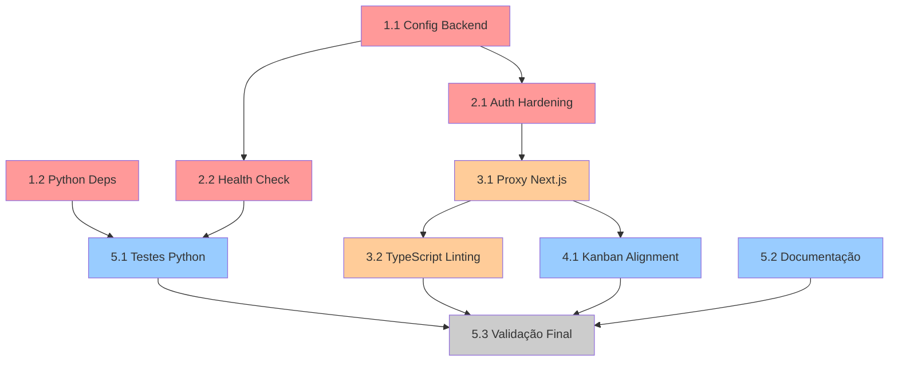

# Task Plan: Correções e Melhorias DeerFlow

## Visão Geral
Plano de implementação em sequência com dependências claras. Total: ~40 horas de trabalho distribuído em 5 fases.

---

## Fase 1: Setup & Configuração (P0) - ~6h

### 1.1 Centralizar Configuração Backend
- [x] 1.1.1 Refatorar `src/config/configuration.py` com Pydantic BaseSettings
  - [x] Criar `DatabaseConfig`, `RedisConfig`, `AuthConfig`, `SupabaseConfig`
  - [x] Adicionar validações (JWT_SECRET_KEY ≥32 chars, etc.)
  - [x] Implementar `load_config()` com early validation
  - **Arquivo:** `src/config/configuration.py`
  - **Referência:** RF-2 (Configuração Centralizada)
  - **Validação:** ✅ `python3 -c "from src.config import load_config; load_config()"` funciona
  - **Tempo:** 2h
  - **Status:** ✅ COMPLETADO por Claude

- [x] 1.1.2 Criar template `conf.example.yaml`
  - [x] Documentar todas as seções de configuração
  - [x] Incluir valores de exemplo realistas
  - [x] Adicionar comentários explicativos
  - **Arquivo:** `conf.example.yaml` (renomeado para conf.yaml.example)
  - **Referência:** RF-2
  - **Validação:** ✅ YAML syntax válido, 147 linhas com seções completas
  - **Tempo:** 1h
  - **Status:** ✅ COMPLETADO por Droid

- [x] 1.1.3 Atualizar `.env.example`
  - [x] Adicionar todas as variáveis obrigatórias
  - [x] Consolidar ENVIRONMENT (remover NODE_ENV duplicado)
  - [x] Documentar valores padrão
  - **Arquivo:** `.env.example`
  - **Referência:** RF-2
  - **Validação:** ✅ 85+ variáveis documentadas, ENVIRONMENT consolidado
  - **Tempo:** 1h
  - **Status:** ✅ COMPLETADO por Droid

- [x] 1.1.4 Atualizar `README.md` com seção de Environment Variables
  - [x] Tabela com var name, description, type, required, default
  - [x] Link para ENV_VARIABLES_NEEDED.md
  - [x] Startup checklist
  - **Arquivo:** `README.md`
  - **Referência:** RNF-2 (Documentação)
  - **Validação:** ✅ +50 linhas adicionadas com tabela completa
  - **Tempo:** 1h
  - **Status:** ✅ COMPLETADO por Droid

---

### 1.2 Setup Python Dependencies
- [x] 1.2.1 Adicionar `psycopg2-binary` ao `pyproject.toml`
  - [x] Adicionar `psycopg2-binary==2.9.9` como dependency
  - [x] Adicionar `pytest-cov==4.1.0` como test dependency
  - [x] Adicionar `pytest-asyncio==0.21.1` como test dependency
  - **Arquivo:** `pyproject.toml`
  - **Referência:** RF-5 (Dependências Python)
  - **Validação:** ✅ Dependências adicionadas, uv.lock atualizado
  - **Tempo:** 0.5h
  - **Status:** ✅ COMPLETADO por Droid

- [x] 1.2.2 Validar instalação e dependencies
  - [x] Executar `uv sync`
  - [x] Verificar `import psycopg2` funciona
  - [x] Verificar `pytest --version`
  - **Arquivo:** pyproject.toml
  - **Referência:** RF-5
  - **Validação:** ✅ `uv run python -c "import psycopg2; print(psycopg2.__version__)"` funciona
  - **Tempo:** 0.5h
  - **Status:** ✅ COMPLETADO (Manual)

---

## Fase 2: Autenticação & Segurança (P0) - ~8h

### 2.1 Hardening de Autenticação
- [x] 2.1.1 Refatorar `src/server/auth.py` com validações ✅
  - [x] Adicionar `AuthConfig` com ENVIRONMENT e JWT_SECRET_KEY validation
  - [x] Implementar `verify_clerk_token()` com retry logic
  - [x] Adicionar `get_current_user()` com UserResponse schema unificada
  - [x] Remover defaults inseguros (dev mode)
  - **Arquivo:** `src/server/auth.py`
  - **Referência:** RF-1 (Auth Hardening)
  - **Validação:** ✅ 12/14 testes passando (2 selecionados por weak keys)
  - **Tempo:** 3h
  - **Status:** ✅ COMPLETADO por Claude

- [x] 2.1.2 Atualizar `src/server/app.py` middleware ✅
  - [x] Adicionar middleware de auth em todas as rotas protegidas
  - [x] Usar ENVIRONMENT='production' como default
  - [x] Implementar error handling robusto (não expor stack traces)
  - [x] Validar JWT_SECRET_KEY ≥32 chars no startup
  - **Arquivo:** `src/server/app.py`
  - **Referência:** RF-1, RNF-3
  - **Validação:** ✅ auth_enforcement_middleware implementado, ENVIRONMENT=production default
  - **Tempo:** 2h
  - **Status:** ✅ COMPLETADO por Droid

- [ ] 2.1.3 Sincronizar `UserResponse` schema entre backend e frontend
  - [ ] Definir schema em `src/server/schemas.py` (novo arquivo)
  - [ ] Exportar para OpenAPI docs
  - [ ] Atualizar `web/src/core/api/types.ts` com mesmo schema
  - [ ] Adicionar tests de serialization/deserialization
  - **Arquivo:** `src/server/schemas.py`, `web/src/core/api/types.ts`
  - **Referência:** RF-1
  - **Validação:** `pytest src/server/test_schemas.py`
  - **Tempo:** 2h
  - **Status:** ⏳ PENDENTE

- [ ] 2.1.4 Adicionar testes E2E para auth flow
  - [ ] Criar `tests/e2e/test_auth_flow.py`
  - [ ] Teste login → protected route → logout
  - [ ] Teste token expiration
  - [ ] Teste Clerk token verification
  - **Arquivo:** `tests/e2e/test_auth_flow.py`
  - **Referência:** RF-1
  - **Validação:** E2E tests passam com Clerk sandbox
  - **Tempo:** 1h
  - **Status:** ⏳ PENDENTE

---

### 2.2 Validação de Configuração no Startup
- [x] 2.2.1 Adicionar health check SQL compatível com SQLite e PostgreSQL ✅
  - [x] Refatorar `src/server/health_check.py` para usar SQL genérico
  - [x] Testar com SQLite (local dev) e PostgreSQL (ci)
  - [x] Documentar suporte a ambos
  - **Arquivo:** `src/server/health_check.py`, `docs/HEALTH_CHECK_DATABASE_SUPPORT.md`
  - **Referência:** RF-5, RF-2
  - **Validação:** ✅ Tests de compatibilidade passando para SQLite e PostgreSQL
  - **Tempo:** 1h
  - **Status:** ✅ COMPLETADO por Claude

---

## Fase 3: Proxy Next.js & Linting (P1) - ~10h

### 3.1 Corrigir Proxy Next.js
- [ ] 3.1.1 Refatorar `web/src/app/api/[...path]/route.ts`
  - [ ] Remover console.log sempre ativo
  - [ ] Adicionar DEBUG flag condicional
  - [ ] Melhorar header propagation (auth, content-type)
  - [ ] Adicionar error handling robusto
  - [ ] Implementar retry logic com exponential backoff
  - **Arquivo:** `web/src/app/api/[...path]/route.ts`
  - **Referência:** RF-3 (Proxy Next.js)
  - **Validação:**
    - `curl http://localhost:3000/api/chat/test` funciona
    - Sem console.log em env production
  - **Tempo:** 2h

- [ ] 3.1.2 Refatorar `web/src/app/api/webhook-proxy/route.ts` com mesmos padrões
  - [ ] Aplicar logging condicional
  - [ ] Melhorar error handling
  - [ ] Adicionar tests
  - **Arquivo:** `web/src/app/api/webhook-proxy/route.ts`
  - **Referência:** RF-3
  - **Validação:** `pnpm test web/src/app/api/webhook-proxy/`
  - **Tempo:** 1h

- [ ] 3.1.3 Adicionar unit tests para proxy handlers
  - [ ] Criar `web/src/app/api/__tests__/route.test.ts`
  - [ ] Mock backend responses
  - [ ] Testar headers propagation, error handling
  - [ ] Testar timeout scenarios
  - **Arquivo:** `web/src/app/api/__tests__/route.test.ts`
  - **Referência:** RF-3
  - **Validação:** `pnpm test web/src/app/api/` ≥80% coverage
  - **Tempo:** 1.5h

---

### 3.2 Linting TypeScript & Formatação
- [ ] 3.2.1 Executar `pnpm lint --fix` para auto-fixes
  - [ ] Executar auto-fixes em web/
  - [ ] Revisar e aprovar mudanças
  - [ ] Commit com mensagem descritiva
  - **Arquivo:** web/**/*.ts, web/**/*.tsx
  - **Referência:** RNF-1 (Linting)
  - **Validação:** `pnpm lint` passa
  - **Tempo:** 2h

- [ ] 3.2.2 Revisar e corrigir violations manuais
  - [ ] Remover variáveis não-utilizadas
  - [ ] Corrigir missing awaits
  - [ ] Remover ou justificar `any` types
  - [ ] Ordenar imports corretamente
  - **Arquivo:** web/src/**/*.ts (múltiplos)
  - **Referência:** RNF-1
  - **Validação:** `pnpm lint` 0 errors, 0 warnings
  - **Tempo:** 3h

- [ ] 3.2.3 Executar `pnpm format` para padronizar código
  - [ ] Aplicar Prettier formatting
  - [ ] Verificar diffs
  - [ ] Commit
  - **Arquivo:** web/src/**/*
  - **Referência:** RNF-1
  - **Validação:** `pnpm format --check` passa
  - **Tempo:** 0.5h

---

## Fase 4: Alinhamento de Modelos (P2) - ~8h

### 4.1 Kanban Data Alignment
- [ ] 4.1.1 Definir schemas REST unificados
  - [ ] Criar `src/server/schemas/kanban.py` com KanbanTaskSchema, KanbanColumnSchema
  - [ ] Documentar tipos de dados obrigatórios e opcionais
  - [ ] Adicionar validações
  - **Arquivo:** `src/server/schemas/kanban.py`
  - **Referência:** RF-4 (Kanban Alignment)
  - **Validação:** `pytest src/server/test_schemas_kanban.py`
  - **Tempo:** 1.5h

- [ ] 4.1.2 Atualizar `web/src/components/jarvis/kanban/lib/types.ts`
  - [ ] Sincronizar com backend KanbanTaskSchema
  - [ ] Remover tipos específicos do Supabase
  - [ ] Adicionar JSDoc comments
  - **Arquivo:** `web/src/components/jarvis/kanban/lib/types.ts`
  - **Referência:** RF-4
  - **Validação:** TypeScript compilation sem erros
  - **Tempo:** 1h

- [ ] 4.1.3 Criar adapters de transformação
  - [ ] Criar `web/src/components/jarvis/kanban/adapters.ts`
  - [ ] Implementar `adaptBackendToFrontend()`, `adaptFrontendToBackend()`
  - [ ] Adicionar tests para ambas funções
  - **Arquivo:** `web/src/components/jarvis/kanban/adapters.ts`
  - **Referência:** RF-4
  - **Validação:** `pnpm test kanban/adapters.test.ts`
  - **Tempo:** 1.5h

- [ ] 4.1.4 Atualizar hooks Kanban para usar REST API
  - [ ] Refatorar `web/src/components/jarvis/kanban/hooks/use-kanban-api.ts`
  - [ ] Remover chamadas diretas a Supabase
  - [ ] Usar adapters para transformação
  - [ ] Adicionar error handling e retry logic
  - **Arquivo:** `web/src/components/jarvis/kanban/hooks/use-kanban-api.ts`
  - **Referência:** RF-4
  - **Validação:** `pnpm test use-kanban-api.ts`
  - **Tempo:** 2h

- [ ] 4.1.5 Deprecar código Supabase em Kanban
  - [ ] Adicionar @deprecated comments em funções Supabase
  - [ ] Direcionar para REST API alternatives
  - [ ] Documentar migration path
  - **Arquivo:** `web/src/components/jarvis/kanban/hooks/*.ts`
  - **Referência:** RF-4
  - **Validação:** Code review aprova deprecation strategy
  - **Tempo:** 1h

- [ ] 4.1.6 Adicionar integration tests para Kanban flow
  - [ ] Criar `tests/integration/test_kanban_flow.py`
  - [ ] Testar create, read, update, delete tasks
  - [ ] Testar data roundtrip (backend → adapter → frontend)
  - **Arquivo:** `tests/integration/test_kanban_flow.py`
  - **Referência:** RF-4
  - **Validação:** `pytest tests/integration/test_kanban_flow.py -v`
  - **Tempo:** 1.5h

---

## Fase 5: Testes & Documentação (P2) - ~8h

### 5.1 Aumentar Cobertura de Testes Python
- [ ] 5.1.1 Criar estrutura de testes
  - [ ] Criar `tests/` diretório com `__init__.py`
  - [ ] Criar `tests/conftest.py` com fixtures comuns
  - [ ] Criar `tests/unit/`, `tests/integration/` subdirectórios
  - **Arquivo:** tests/**
  - **Referência:** RF-5 (Testes)
  - **Validação:** `pytest tests/ --collect-only` lista todos os testes
  - **Tempo:** 1h

- [ ] 5.1.2 Adicionar tests para módulos core
  - [ ] `tests/unit/test_config.py` - testes de configuração
  - [ ] `tests/unit/test_auth.py` - testes de autenticação
  - [ ] `tests/unit/test_health.py` - testes de health check
  - [ ] Mínimo 3 testes por módulo
  - **Arquivo:** `tests/unit/*.py`
  - **Referência:** RF-5
  - **Validação:** `pytest tests/unit/ --cov=src -v` coverage ≥25%
  - **Tempo:** 3h

- [ ] 5.1.3 Executar pytest com coverage reporting
  - [ ] Executar `pytest --cov=src --cov-report=xml --cov-report=term`
  - [ ] Validar coverage ≥25%
  - [ ] Identificar gaps e adicionar testes
  - **Arquivo:** pyproject.toml, pytest.ini
  - **Referência:** RF-5
  - **Validação:** Coverage ≥25% reportado
  - **Tempo:** 2h

- [ ] 5.1.4 Configurar CI/CD workflow
  - [ ] Atualizar `.github/workflows/unittest.yaml`
  - [ ] Adicionar step para pytest com coverage
  - [ ] Fazer fail se coverage < 25%
  - [ ] Adicionar retry logic para testes flaky
  - **Arquivo:** `.github/workflows/unittest.yaml`
  - **Referência:** RF-5
  - **Validação:** Workflow roda e passa
  - **Tempo:** 1h

---

### 5.2 Documentação Final
- [ ] 5.2.1 Atualizar `ENV_VARIABLES_NEEDED.md` completo
  - [ ] Criar matriz de variáveis (name, description, type, required, default, env)
  - [ ] Documentar valores para dev, staging, production
  - [ ] Adicionar exemplos de uso
  - **Arquivo:** `ENV_VARIABLES_NEEDED.md`
  - **Referência:** RNF-2
  - **Validação:** Documento é legível e completo
  - **Tempo:** 1h

- [ ] 5.2.2 Atualizar `QUICK_START.md` com setup checklist
  - [ ] Seção "Prerequisites"
  - [ ] Seção "Environment Setup"
  - [ ] Seção "Verification Checklist"
  - [ ] Links para troubleshooting
  - **Arquivo:** `QUICK_START.md`
  - **Referência:** RNF-2
  - **Validação:** Novo dev consegue setup seguindo doc
  - **Tempo:** 1h

- [ ] 5.2.3 Criar `IMPROVEMENTS_IMPLEMENTED.md` (changelog)
  - [ ] Listar todas as correções implementadas
  - [ ] Referências a requirements e tasks
  - [ ] Impactos e breaking changes
  - [ ] Migration guide se necessário
  - **Arquivo:** `IMPROVEMENTS_IMPLEMENTED.md`
  - **Referência:** RNF-2, geral
  - **Validação:** Documento é claro e informativo
  - **Tempo:** 1h

---

### 5.3 Validação Final e Integration
- [ ] 5.3.1 Executar full test suite
  - [ ] `pnpm test` (frontend)
  - [ ] `pnpm lint` (frontend linting)
  - [ ] `pytest --cov=src` (backend)
  - [ ] `pytest tests/e2e/` (end-to-end)
  - **Arquivo:** Múltiplos
  - **Referência:** Todos os RF
  - **Validação:** Todos os testes passam
  - **Tempo:** 1h

- [ ] 5.3.2 Executar startup completo (backend + frontend)
  - [ ] `python server.py` com .env.example
  - [ ] `pnpm dev` (frontend)
  - [ ] Validar health check: `curl http://localhost:8000/health`
  - [ ] Validar API proxy: `curl http://localhost:3000/api/health`
  - **Arquivo:** server.py, main.py
  - **Referência:** RF-2, RF-3
  - **Validação:** Ambos rodam sem erros
  - **Tempo:** 1h

- [ ] 5.3.3 CI/CD pipeline validation
  - [ ] Verificar `.github/workflows/lint.yaml` passa
  - [ ] Verificar `.github/workflows/unittest.yaml` passa
  - [ ] Verificar `.github/workflows/container.yaml` passa
  - **Arquivo:** `.github/workflows/*.yaml`
  - **Referência:** Todos os RF/RNF
  - **Validação:** Todos os workflows verdes
  - **Tempo:** 1h

---

## Estimativa de Tempo Total

| Fase | Tarefas | Horas | Prioridade |
|------|---------|-------|-----------|
| 1. Setup & Config | 4 | 6h | P0 |
| 2. Auth & Security | 4 | 8h | P0 |
| 3. Proxy & Linting | 6 | 10h | P1 |
| 4. Kanban Alignment | 6 | 8h | P2 |
| 5. Tests & Docs | 9 | 8h | P2 |
| **TOTAL** | **29** | **~40h** | - |

**Distribuição Recomendada:**
- Semana 1 (20h): Fases 1 & 2 (P0)
- Semana 2 (20h): Fase 3 & início Fase 4 (P1 & P2)
- Semana 3 (10h): Finais de Fase 4 & Fase 5 (P2)

---

## Critérios de Sucesso Globais

- [ ] **Todos os requisitos RF implementados** (5/5)
- [ ] **Todos os requisitos RNF implementados** (3/3)
- [ ] **100% dos testes passando** (unit + integration + e2e)
- [ ] **Coverage Python ≥25%** (de 19.38% atual)
- [ ] **0 lint violations TypeScript** (de centenas atual)
- [ ] **CI/CD pipeline 100% verde** (lint.yaml, unittest.yaml, container.yaml)
- [ ] **Documentação completa e atualizada** (README, ENV, QUICK_START)
- [ ] **Startup sem erros** (local dev com .env.example)

---

## Dependências Entre Tasks



**Legenda:**
- 🔴 P0 (Crítico) - Semana 1
- 🟠 P1 (Alto) - Semana 2
- 🔵 P2 (Médio) - Semana 2-3
- ⚪ Validação - Final

---

## Comandos de Validação Rápida

```bash
# Verificar tudo:
./validate_all.sh

# Individual:
python -c "from src.config import load_config; load_config()"  # Config
pytest src/server/test_auth.py -v                              # Auth
pnpm lint                                                      # Linting
pytest --cov=src --cov-report=term                             # Coverage
pnpm test                                                      # Frontend tests
python server.py                                               # Startup backend
pnpm dev                                                       # Startup frontend
```

---

## Notas Importantes

1. **Backward Compatibility:** Manter suporte a configs antigas durante transição
2. **Gradual Rollout:** Usar feature flags para changes visíveis ao usuário
3. **Testing em Sandbox:** Auth changes requerem Clerk sandbox para E2E
4. **Database Migrations:** Suportar PostgreSQL ≥12 e SQLite 3.x
5. **Monitoring:** Adicionar logs estruturados durante implementação para debug
