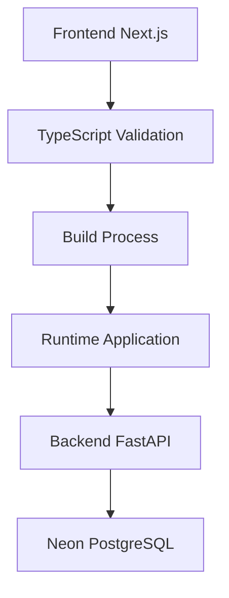

# Design: deerflow-critical-fixes

## 1. Architecture Overview
### 1.1 High-Level Architecture


### 1.2 Component Structure
- **TypeScript Validation**: Correção de tipos e interfaces
- **Test Framework**: Configuração de Jest/Vitest
- **Build Pipeline**: Garantir build sem erros
- **Runtime Validation**: Verificar funcionamento completo

## 2. Data Models
### 2.1 TypeScript Interfaces
```typescript
// Message interface correction
interface Message {
  id: string;
  threadId: string;
  content: string;
  role: "user" | "assistant";
  contentChunks: string[];
}
```

### 2.2 Test Configuration
```json
// package.json scripts
{
  "test": "jest",
  "test:watch": "jest --watch",
  "typecheck": "tsc --noEmit"
}
```

## 3. Implementation Details
### 3.1 Technology Stack
- Frontend: Next.js 14, TypeScript
- Backend: FastAPI (already functional)
- Testing: Jest ou Vitest
- Linting: ESLint com auto-fix

### 3.2 Key Algorithms
**TypeScript Error Resolution:**
1. Identify missing properties in Message objects
2. Add threadId and contentChunks to test mocks
3. Resolve Playwright dependency issues
4. Fix ESLint violations systematically

### 3.3 Error Handling
- TypeScript compilation errors: Fix interface mismatches
- Runtime errors: Add proper error boundaries
- Test failures: Configure test framework properly

## 4. Security Considerations
- Maintain existing Clerk authentication
- Preserve Neon PostgreSQL security (RLS)
- No changes to auth middleware required

## 5. Testing Strategy
### 5.1 Unit Tests
Configure Jest/Vitest for existing test files:
- Test file: `src/core/store/__tests__/events.test.ts`
- Mock Message objects with complete interface

### 5.2 Integration Tests
- Frontend accessibility: Test localhost:4000 response
- Build validation: Ensure production build succeeds
- API connectivity: Verify backend communication

### 5.3 End-to-End Tests
- User login flow via Clerk
- Project creation workflow
- Chat functionality validation

## 6. Deployment
### 6.1 Dependencies
- Add missing packages: `@playwright/test` or remove test file
- Configure Jest/Vitest as test runner
- Update ESLint configuration for auto-fix

### 6.2 Migration Path
- Step 1: Fix TypeScript errors (blocking)
- Step 2: Configure test framework
- Step 3: Validate build and runtime
- Step 4: Full functional testing

## 7. Validation Checklist
- [ ] pnpm typecheck: Zero errors
- [ ] pnpm build: Successful completion
- [ ] pnpm test: Tests execute properly
- [ ] localhost:4000: Responds with 200
- [ ] All pages load without runtime errors
- [ ] ESLint warnings: Minimized to acceptable level