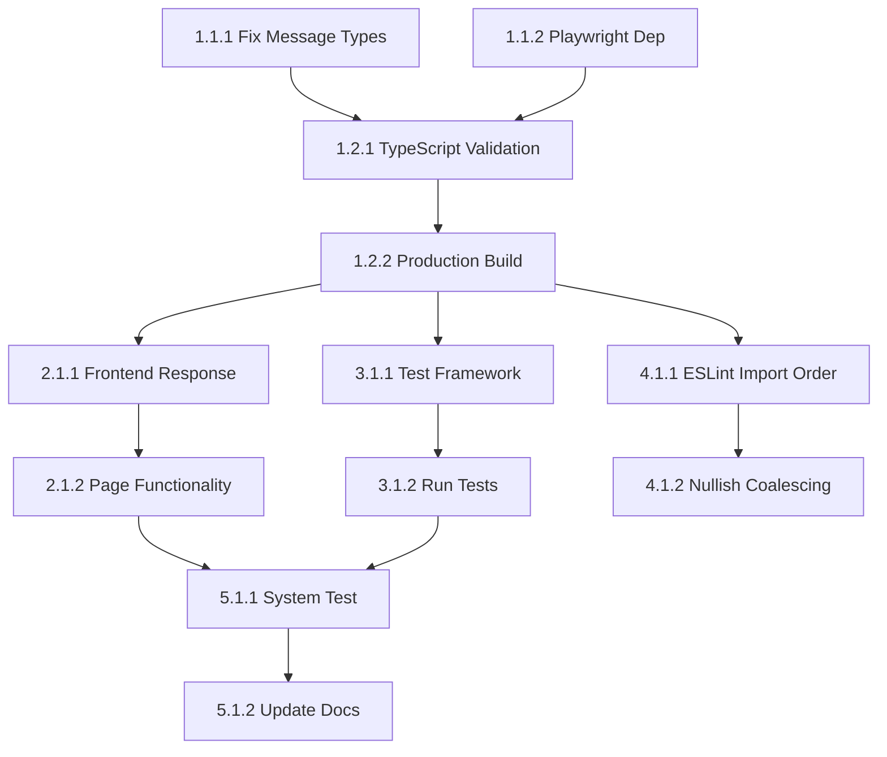

# Tasks: deerflow-critical-fixes

## Phase 1: Critical Error Resolution
### 1.1 TypeScript Errors
- **Task 1.1.1**: Fix Message interface errors in events.test.ts
  - Agent: Claude
  - Priority: High
  - Dependencies: None
  - Files: src/core/store/__tests__/events.test.ts
  - Acceptance: All mock Message objects include threadId and contentChunks properties
  - Requirements: 2.1.1

- **Task 1.1.2**: Resolve Playwright dependency issue
  - Agent: Claude
  - Priority: High
  - Dependencies: None
  - Files: test-playwright.cjs
  - Acceptance: Either @playwright/test installed or test-playwright.cjs moved/removed
  - Requirements: 2.1.1

### 1.2 Build Validation
- **Task 1.2.1**: Validate TypeScript compilation
  - Agent: Claude
  - Priority: High
  - Dependencies: Task 1.1.1, Task 1.1.2
  - Files: web/
  - Acceptance: pnpm typecheck returns zero errors
  - Requirements: 2.1.3

- **Task 1.2.2**: Validate production build
  - Agent: Claude
  - Priority: High
  - Dependencies: Task 1.2.1
  - Files: web/
  - Acceptance: pnpm build completes successfully
  - Requirements: 2.1.3

## Phase 2: Runtime Validation
### 2.1 Frontend Accessibility
- **Task 2.1.1**: Verify frontend server response
  - Agent: Claude
  - Priority: High
  - Dependencies: Task 1.2.2
  - Files: web/
  - Acceptance: localhost:4000 responds with status 200
  - Requirements: 2.1.2

- **Task 2.1.2**: Test main pages functionality
  - Agent: Claude
  - Priority: Medium
  - Dependencies: Task 2.1.1
  - Files: src/app/
  - Acceptance: All main pages load without runtime errors
  - Requirements: 2.1.5

## Phase 3: Test Framework Setup
### 3.1 Test Configuration
- **Task 3.1.1**: Configure Jest or Vitest
  - Agent: Claude
  - Priority: Medium
  - Dependencies: Task 1.2.2
  - Files: package.json, jest.config.js or vitest.config.ts
  - Acceptance: pnpm test executes existing test files
  - Requirements: 2.1.4

- **Task 3.1.2**: Run automated tests
  - Agent: Claude
  - Priority: Medium
  - Dependencies: Task 3.1.1
  - Files: src/core/store/__tests__/
  - Acceptance: All tests pass without errors
  - Requirements: 2.1.4

## Phase 4: Code Quality
### 4.1 ESLint Issues
- **Task 4.1.1**: Fix import order issues
  - Agent: Claude
  - Priority: Low
  - Dependencies: Task 1.2.2
  - Files: Multiple files with import order violations
  - Acceptance: ESLint import order errors resolved
  - Requirements: 3.1

- **Task 4.1.2**: Replace || with ?? operators
  - Agent: Claude
  - Priority: Low
  - Dependencies: Task 4.1.1
  - Files: src/hooks/use-authenticated-api.ts, src/core/contexts/auth-context.tsx
  - Acceptance: ESLint nullish coalescing warnings resolved
  - Requirements: 3.1

## Phase 5: Final Validation
### 5.1 Complete System Test
- **Task 5.1.1**: Comprehensive functionality test
  - Agent: Claude
  - Priority: High
  - Dependencies: Task 2.1.2, Task 3.1.2
  - Files: web/
  - Acceptance: All core functionality working, no critical errors
  - Requirements: 2.1.5

- **Task 5.1.2**: Update documentation
  - Agent: Claude
  - Priority: Low
  - Dependencies: Task 5.1.1
  - Files: FIXES_COMPLETE.md
  - Acceptance: Documentation updated with real status
  - Requirements: 2.1.5

## Dependencies Graph

## Total Tasks: 10
**Estimated Time**: 2-3 hours
**Success Metrics**: Zero TypeScript errors, functional frontend, passing tests