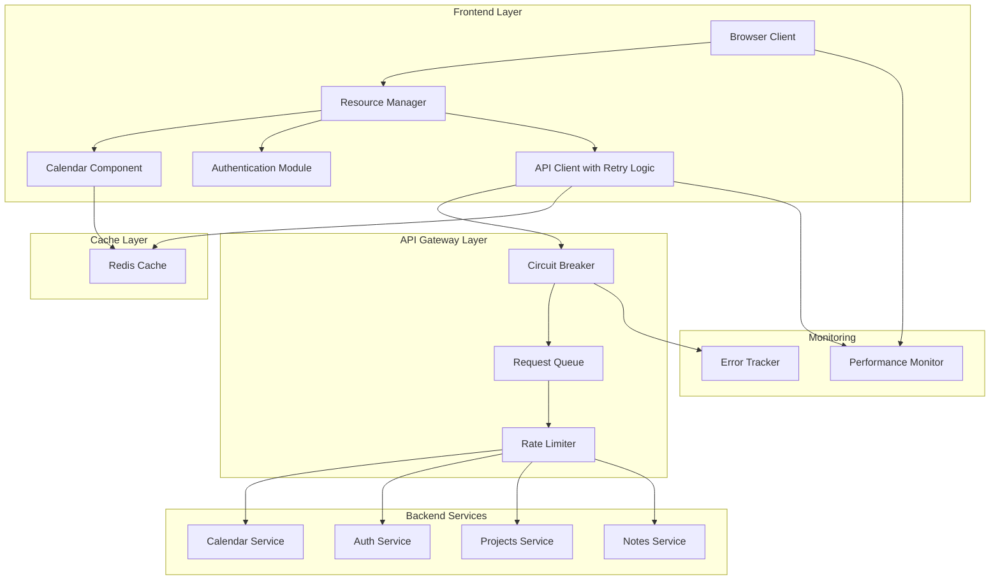
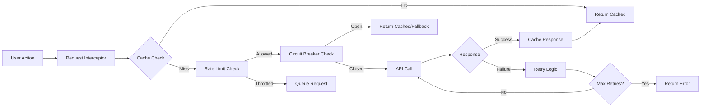
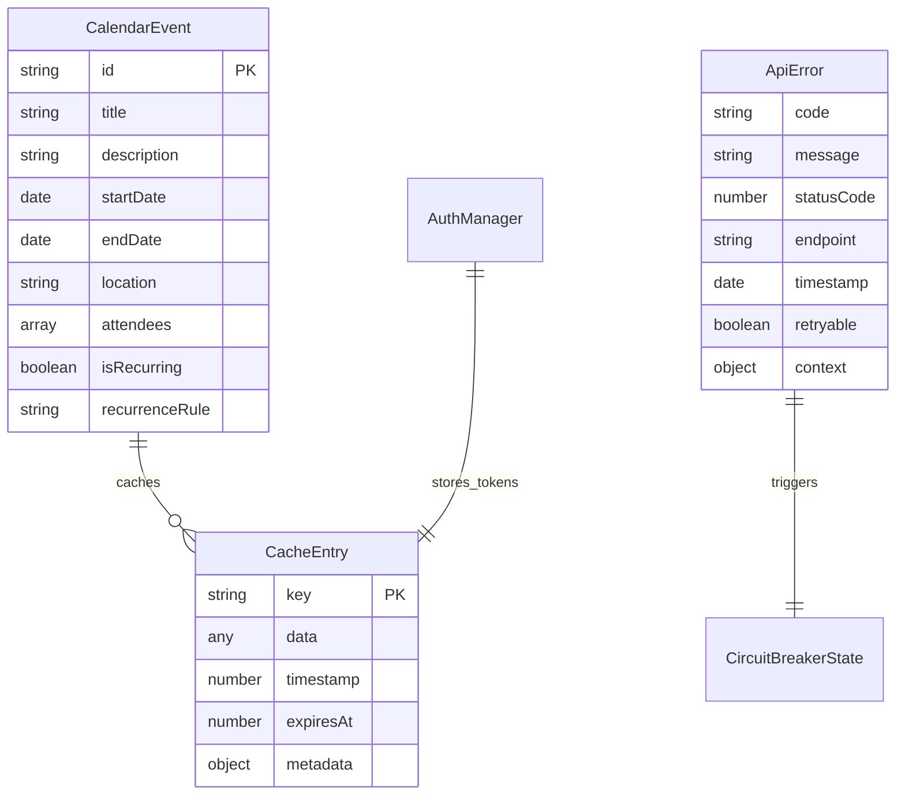
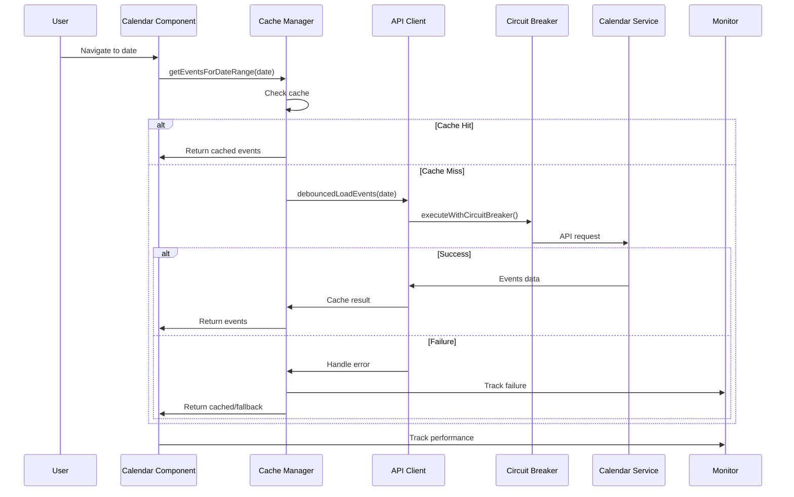
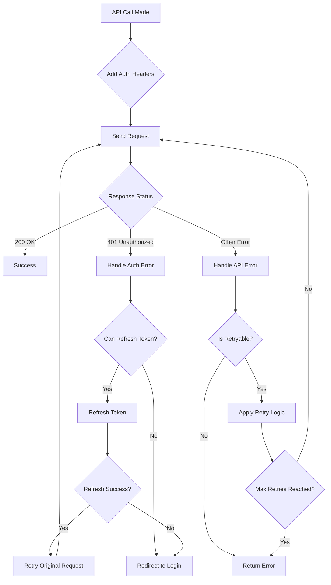
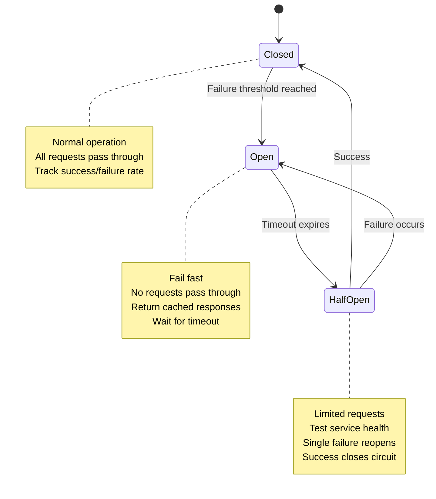

# Design Document: Performance & Reliability Fix

## Overview

This design addresses critical performance and reliability issues through a multi-layered approach focusing on frontend optimization, backend resilience, authentication improvements, and comprehensive error handling. The solution implements caching, debouncing, circuit breakers, and monitoring while maintaining backward compatibility.

## Architecture Design

### System Architecture Diagram



### Data Flow Diagram



## Component Design

### 1. Calendar Performance Component

#### CalendarCacheManager
```typescript
interface CalendarCacheManager {
  // Cache management
  getEventsForDateRange(startDate: Date, endDate: Date): Promise<CalendarEvent[]>
  cacheEvents(dateRange: DateRange, events: CalendarEvent[]): void
  invalidateCache(dateRange?: DateRange): void
  
  // Debouncing
  debouncedLoadEvents: (startDate: Date, endDate: Date) => Promise<CalendarEvent[]>
  
  // Batch processing
  batchLoadDates(dates: Date[]): Promise<Map<Date, CalendarEvent[]>>
}

interface DateRange {
  start: Date
  end: Date
}
```

**Responsibilities:**
- Cache calendar events by date ranges
- Implement debounced API calls (300ms minimum)
- Batch multiple date requests into single API calls
- Cache negative results (empty date ranges) for 5 minutes

**Dependencies:**
- Cache service (Redis/localStorage)
- Calendar API service
- Performance monitor

### 2. Resource Preload Manager

#### ResourcePreloadOptimizer
```typescript
interface ResourcePreloadOptimizer {
  // Preload validation
  validatePreloads(): PreloadValidationResult[]
  optimizePreloadDirectives(): Promise<void>
  
  // Dynamic preload management
  addPreload(resource: PreloadResource): void
  removeUnusedPreloads(): void
  
  // Monitoring
  trackPreloadUsage(resourceUrl: string): void
  getPreloadMetrics(): PreloadMetrics[]
}

interface PreloadResource {
  url: string
  as: 'script' | 'style' | 'image' | 'document' | 'font'
  priority?: 'high' | 'low'
  timeout?: number
}
```

**Responsibilities:**
- Validate and correct preload `as` attributes
- Monitor preload usage and remove unused resources
- Implement timeout-based preload cleanup
- Track preload effectiveness metrics

**Dependencies:**
- DOM manipulation APIs
- Performance observer API
- Resource timing API

### 3. Resilient API Client

#### ResilientApiClient
```typescript
interface ResilientApiClient {
  // Circuit breaker
  executeWithCircuitBreaker<T>(
    operation: () => Promise<T>,
    serviceName: string
  ): Promise<T>
  
  // Retry logic
  executeWithRetry<T>(
    operation: () => Promise<T>,
    options: RetryOptions
  ): Promise<T>
  
  // Error handling
  handleApiError(error: ApiError): ErrorHandlingResult
  
  // Monitoring
  trackApiCall(endpoint: string, duration: number, success: boolean): void
}

interface RetryOptions {
  maxRetries: number
  baseDelay: number
  maxDelay: number
  backoffMultiplier: number
  retryableErrors: number[]
}
```

**Responsibilities:**
- Implement circuit breaker pattern for service protection
- Handle exponential backoff retry logic
- Classify errors and apply appropriate handling strategies
- Track API performance metrics

**Dependencies:**
- HTTP client library
- Circuit breaker implementation
- Error classification service

### 4. Authentication Manager

#### AuthManager
```typescript
interface AuthManager {
  // Token management
  getCurrentToken(): Promise<string | null>
  refreshToken(): Promise<boolean>
  invalidateToken(): void
  
  // Request interception
  addAuthHeaders(request: ApiRequest): Promise<ApiRequest>
  
  // Error handling
  handleAuthError(error: ApiError): Promise<AuthErrorResult>
  
  // Automatic retry
  retryWithNewAuth<T>(operation: () => Promise<T>): Promise<T>
}
```

**Responsibilities:**
- Manage JWT token lifecycle
- Automatic token refresh
- Handle 401 errors with token retry
- Queue requests during token refresh

**Dependencies:**
- Token storage (secure)
- Auth service endpoints
- Token refresh logic

## Data Models

### Core Data Structure Definitions

```typescript
// Calendar Events
interface CalendarEvent {
  id: string
  title: string
  description?: string
  startDate: Date
  endDate: Date
  location?: string
  attendees?: string[]
  isRecurring: boolean
  recurrenceRule?: string
}

// Cache Entries
interface CacheEntry<T> {
  data: T
  timestamp: number
  expiresAt: number
  key: string
  metadata: CacheMetadata
}

interface CacheMetadata {
  source: 'api' | 'computed'
  hitCount: number
  lastAccessed: number
  size: number
}

// API Errors
interface ApiError {
  code: string
  message: string
  statusCode: number
  endpoint: string
  timestamp: Date
  retryable: boolean
  context?: Record<string, any>
}

// Circuit Breaker State
interface CircuitBreakerState {
  service: string
  state: 'closed' | 'open' | 'half-open'
  failureCount: number
  lastFailureTime: Date
  nextAttemptTime: Date
}
```

### Data Model Diagrams



## Business Process

### Process 1: Calendar Event Loading with Caching



### Process 2: Authentication Error Recovery



### Process 3: Circuit Breaker Pattern Implementation



## Error Handling Strategy

### Error Classification System

```typescript
enum ErrorCategory {
  NETWORK = 'network',
  AUTHENTICATION = 'authentication', 
  SERVICE_UNAVAILABLE = 'service_unavailable',
  RATE_LIMIT = 'rate_limit',
  VALIDATION = 'validation',
  UNKNOWN = 'unknown'
}

interface ErrorHandlingStrategy {
  category: ErrorCategory
  retryable: boolean
  userMessage: string
  technicalMessage: string
  recoveryActions: RecoveryAction[]
}

enum RecoveryAction {
  RETRY = 'retry',
  REFRESH_AUTH = 'refresh_auth',
  USE_CACHE = 'use_cache',
  SHOW_OFFLINE = 'show_offline',
  REDIRECT_LOGIN = 'redirect_login',
  CONTACT_SUPPORT = 'contact_support'
}
```

### Error Recovery Patterns

1. **Transient Errors** (503, 502, network timeouts)
   - Apply exponential backoff retry
   - Use cached responses when available
   - Show degraded service indicator

2. **Authentication Errors** (401, 403)
   - Attempt token refresh
   - Queue requests during refresh
   - Redirect to login on failure

3. **Validation Errors** (400, 422)
   - Show specific validation messages
   - Highlight problematic form fields
   - Provide correction suggestions

4. **Rate Limiting** (429)
   - Implement request queuing
   - Show rate limit status
   - Auto-resume when limit resets

## Testing Strategy

### Unit Tests
- **CalendarCacheManager**: Test caching logic, debouncing, batch operations
- **ResourcePreloadOptimizer**: Test preload validation and cleanup
- **ResilientApiClient**: Test circuit breaker and retry logic
- **AuthManager**: Test token refresh and error handling

### Integration Tests
- **End-to-end calendar loading**: Test complete flow with caching failures
- **API resilience**: Test circuit breaker with actual service failures
- **Authentication flow**: Test token refresh scenarios
- **Performance impact**: Measure before/after optimization

### Load Testing
- **Concurrent calendar requests**: Test cache efficiency under load
- **API failure scenarios**: Test circuit breaker behavior
- **Resource loading**: Test preload optimization impact

## Deployment

### Dependencies
- **Frontend**: React 18+, TypeScript, modern browser APIs
- **Caching**: Redis or localStorage fallback
- **Monitoring**: Performance Observer API, custom metrics
- **Backend**: Existing API endpoints with circuit breaker support

### Migration Path
1. **Phase 1**: Deploy caching layer with feature flags
2. **Phase 2**: Enable circuit breakers for non-critical services
3. **Phase 3**: Optimize resource preloading
4. **Phase 4**: Enable full authentication improvements
5. **Phase 5**: Activate comprehensive monitoring

### Rollback Strategy
- Feature flags for each optimization component
- Fallback to original API client on critical errors
- Cache invalidation on rollback
- Performance metrics comparison for validation

## Security Considerations

- **Token Storage**: Use secure httpOnly cookies or secure storage
- **Cache Security**: Sanitize cached data, implement TTL
- **Circuit Breaker**: Prevent service enumeration through failure patterns
- **Rate Limiting**: Implement per-user rate limiting
- **Input Validation**: Validate all cached and API data
- **Error Information**: Avoid exposing sensitive information in error messages

## Performance Targets

- **Calendar Load Time**: < 500ms (cached), < 2s (uncached)
- **API Response Time**: 95th percentile < 1s
- **Cache Hit Rate**: > 80% for calendar events
- **Error Rate**: < 1% for authenticated requests
- **Resource Load Efficiency**: < 5% unused preloads
- **Circuit Breaker Recovery**: < 30s to service restoration