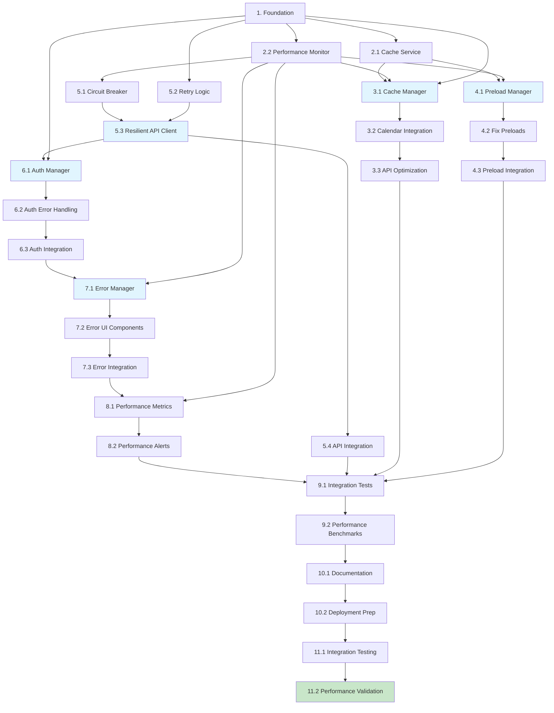

# Implementation Plan: Performance & Reliability Fix

## Task Overview

This implementation plan converts the design into specific coding tasks that systematically address all performance and reliability issues. Tasks are organized by component and dependency order to ensure smooth implementation and testing.

## Phase 1: Foundation and Core Infrastructure

- [ ] 1. Set up project structure and core interfaces
  - Create TypeScript interfaces for all data models and components
  - Set up directory structure for new performance modules
  - Define utility types and constants for error handling and caching
  - _Requirements: 1.1, 2.1, 3.1, 4.1, 5.1_

- [ ] 2. Implement core caching infrastructure
- [ ] 2.1 Create cache service with Redis/localStorage fallback
  - Write CacheService class with TTL support and automatic cleanup
  - Implement cache key generation and validation
  - Create unit tests for cache operations and TTL behavior
  - _Requirements: 1.1, 1.4, 6.1_

- [ ] 2.2 Implement performance monitoring utilities
  - Write PerformanceMonitor class for API call tracking
  - Create performance metrics collection and reporting
  - Implement browser Performance Observer integration
  - Write unit tests for performance tracking accuracy
  - _Requirements: 6.1, 6.2, 6.3_

## Phase 2: Calendar Performance Optimization

- [ ] 3. Create calendar cache manager
- [ ] 3.1 Implement CalendarCacheManager class
  - Write CalendarCacheManager with date range caching logic
  - Implement debounced API calls with 300ms minimum delay
  - Create batch processing for multiple date requests
  - Write unit tests for caching, debouncing, and batching
  - _Requirements: 1.1, 1.2, 1.3, 1.4, 1.5_

- [ ] 3.2 Integrate cache manager with calendar component
  - Modify existing calendar component to use CalendarCacheManager
  - Replace direct API calls with cached/batched calls
  - Implement cache invalidation on component unmount
  - Write integration tests for calendar component performance
  - _Requirements: 1.1, 1.2, 1.4, 1.5_

- [ ] 3.3 Optimize calendar API calls
  - Update calendar API service to support date range requests
  - Implement negative result caching for empty date ranges
  - Add performance metrics tracking for calendar operations
  - Write unit tests for API service optimizations
  - _Requirements: 1.1, 1.3, 1.4_

## Phase 3: Resource Preloading Optimization

- [ ] 4. Create resource preload manager
- [ ] 4.1 Implement ResourcePreloadOptimizer class
  - Write ResourcePreloadOptimizer with preload validation logic
  - Implement dynamic preload management and cleanup
  - Create preload usage tracking with timeout detection
  - Write unit tests for preload optimization and cleanup
  - _Requirements: 2.1, 2.2, 2.3, 2.4, 2.5_

- [ ] 4.2 Fix existing preload directives
  - Scan and analyze current preload tags in the application
  - Correct `as` attribute values for all preload resources
  - Remove unused or ineffective preload directives
  - Implement automatic preload validation and reporting
  - _Requirements: 2.1, 2.2, 2.5_

- [ ] 4.3 Integrate preload optimizer with application startup
  - Initialize ResourcePreloadOptimizer on application bootstrap
  - Implement runtime preload monitoring and cleanup
  - Add performance metrics for preload effectiveness
  - Write integration tests for preload optimization impact
  - _Requirements: 2.2, 2.4, 6.3_

## Phase 4: API Resilience and Circuit Breaker

- [ ] 5. Create resilient API client
- [ ] 5.1 Implement circuit breaker pattern
  - Write CircuitBreaker class with state management
  - Implement failure threshold detection and automatic recovery
  - Create circuit breaker event handling and monitoring
  - Write unit tests for circuit breaker states and transitions
  - _Requirements: 3.1, 3.2, 3.4, 3.5_

- [ ] 5.2 Implement retry logic with exponential backoff
  - Write RetryManager class with configurable retry strategies
  - Implement exponential backoff with jitter and maximum limits
  - Create retry condition evaluation for different error types
  - Write unit tests for retry logic and backoff behavior
  - _Requirements: 3.1, 3.3, 3.4_

- [ ] 5.3 Create ResilientApiClient wrapper
  - Write ResilientApiClient combining circuit breaker and retry logic
  - Implement error classification and handling strategies
  - Add performance tracking for API calls and failures
  - Write unit tests for complete API resilience behavior
  - _Requirements: 3.1, 3.2, 3.3, 3.4, 6.1_

- [ ] 5.4 Replace existing API calls with resilient client
  - Update all API service calls to use ResilientApiClient
  - Implement fallback data for critical operations
  - Add circuit breaker monitoring and alerting
  - Write integration tests for API resilience under failure conditions
  - _Requirements: 3.1, 3.2, 3.3, 3.4, 3.5_

## Phase 5: Authentication System Improvements

- [ ] 6. Create authentication manager
- [ ] 6.1 Implement AuthManager class
  - Write AuthManager with token lifecycle management
  - Implement automatic token refresh with error handling
  - Create request queuing during token refresh operations
  - Write unit tests for token management and refresh logic
  - _Requirements: 4.1, 4.2, 4.3, 4.4_

- [ ] 6.2 Implement authentication error handling
  - Write authentication error classification and recovery
  - Implement automatic retry with fresh authentication tokens
  - Create user-friendly error messages for auth failures
  - Write unit tests for auth error recovery scenarios
  - _Requirements: 4.2, 4.3, 4.5_

- [ ] 6.3 Integrate AuthManager with API client
  - Modify ResilientApiClient to use AuthManager for auth
  - Implement automatic header injection and token refresh
  - Add authentication state monitoring and metrics
  - Write integration tests for authenticated API calls with retries
  - _Requirements: 4.1, 4.2, 4.3, 4.4, 4.5_

## Phase 6: Error Handling and User Experience

- [ ] 7. Create comprehensive error handling system
- [ ] 7.1 Implement ErrorManager class
  - Write ErrorManager with error classification and routing
  - Implement user-friendly error message generation
  - Create error recovery action suggestions and triggers
  - Write unit tests for error handling and message generation
  - _Requirements: 5.1, 5.2, 5.3, 5.4, 5.5_

- [ ] 7.2 Create error UI components
  - Write reusable error display components with retry buttons
  - Implement offline indicators and connectivity status
  - Create toast notifications for transient errors
  - Write unit tests for error component behavior and accessibility
  - _Requirements: 5.1, 5.2, 5.3, 5.4_

- [ ] 7.3 Integrate error handling throughout application
  - Update all error boundaries to use ErrorManager
  - Implement error recovery workflows in major components
  - Add error tracking and monitoring integration
  - Write integration tests for error handling in real user scenarios
  - _Requirements: 5.1, 5.2, 5.3, 5.4, 5.5_

## Phase 7: Performance Monitoring and Analytics

- [ ] 8. Create performance monitoring dashboard
- [ ] 8.1 Implement performance metrics collection
  - Write comprehensive performance tracking for all components
  - Create real-time performance dashboards and alerts
  - Implement performance regression detection and reporting
  - Write unit tests for metrics accuracy and dashboard functionality
  - _Requirements: 6.1, 6.2, 6.3, 6.4, 6.5_

- [ ] 8.2 Add performance alerts and reporting
  - Implement threshold-based alerting for performance issues
  - Create performance trend analysis and reporting
  - Add automated performance regression detection
  - Write integration tests for alerting and reporting systems
  - _Requirements: 6.1, 6.2, 6.4, 6.5_

## Phase 8: Testing and Quality Assurance

- [ ] 9. Create comprehensive test suite
- [ ] 9.1 Write integration tests for end-to-end scenarios
  - Create tests for calendar performance under various conditions
  - Write tests for API resilience with simulated failures
  - Implement tests for authentication flows and error recovery
  - Create load tests for concurrent user scenarios
  - _Requirements: All requirements_

- [ ] 9.2 Implement performance benchmarks
  - Write performance benchmarks before and after optimization
  - Create automated performance regression tests
  - Implement continuous performance monitoring in CI/CD
  - Write documentation for performance targets and monitoring
  - _Requirements: 6.1, 6.2, 6.3, 6.5_

## Phase 9: Documentation and Deployment

- [ ] 10. Create documentation and deployment preparation
- [ ] 10.1 Write technical documentation
  - Document all new components and their usage
  - Create troubleshooting guides for common performance issues
  - Write API documentation for new performance endpoints
  - Create user documentation for new error handling features
  - _Requirements: All requirements_

- [ ] 10.2 Prepare deployment configuration
  - Create feature flags for gradual rollout of optimizations
  - Implement rollback procedures and health checks
  - Configure monitoring and alerting for production deployment
  - Write deployment scripts and validation procedures
  - _Requirements: All requirements_

## Phase 10: Integration and Final Testing

- [ ] 11. Final integration testing and validation
- [ ] 11.1 Perform end-to-end integration testing
  - Test complete user workflows with all optimizations enabled
  - Validate performance improvements meet targets
  - Test error recovery scenarios in production-like environment
  - Verify monitoring and alerting systems work correctly
  - _Requirements: All requirements_

- [ ] 11.2 Performance validation and optimization
  - Measure and document performance improvements
  - Fine-tune caching strategies based on real usage patterns
  - Optimize circuit breaker thresholds based on testing results
  - Validate all acceptance criteria are met
  - _Requirements: All requirements_

## Task Dependencies Graph

## Implementation Notes

### Development Guidelines
- Each task should be implemented with comprehensive unit tests
- Use TypeScript strict mode for all new code
- Follow existing code style and conventions
- Implement feature flags for gradual rollout
- Monitor performance impact during development

### Quality Assurance
- Code review required for all tasks
- Performance benchmarks before and after each major component
- Integration testing for cross-component interactions
- Security review for authentication and caching components

### Risk Mitigation
- Implement feature flags to enable/disable optimizations
- Maintain backward compatibility with existing functionality
- Create rollback procedures for each optimization component
- Monitor error rates and performance during deployment

## Success Metrics

- Calendar load time reduced by >60%
- API error rate reduced by >80%
- Resource preload warnings eliminated
- Authentication errors reduced by >90%
- User experience satisfaction improved
- System reliability and uptime increased

## Total Tasks: 32
**Estimated Time**: 40-50 hours
**Success Metrics**: All performance targets met with comprehensive monitoring