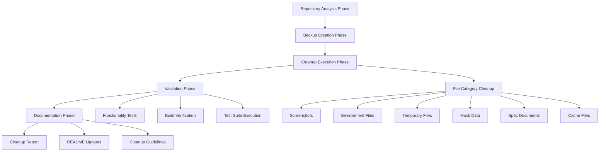
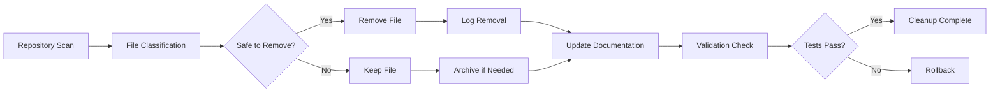
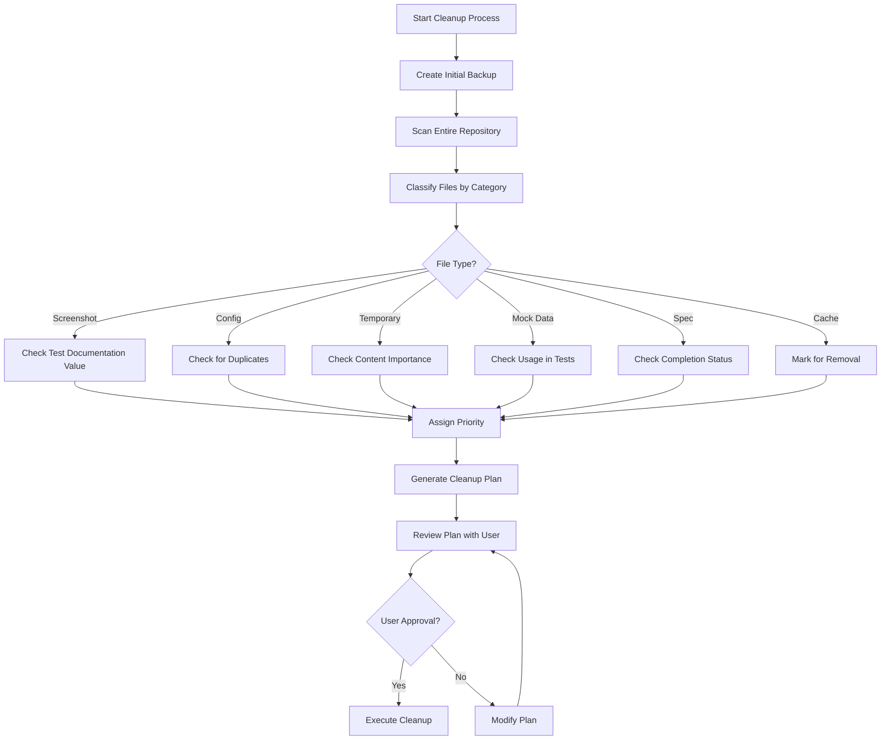
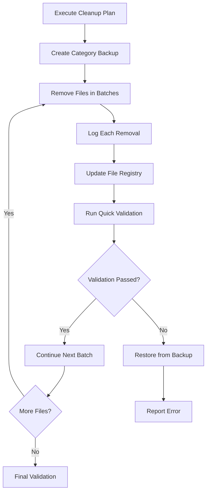
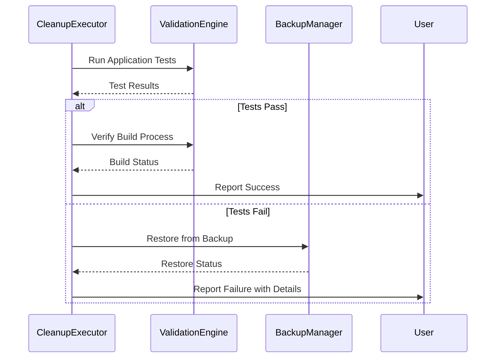

# Design: Repository Cleanup

## Overview

This design document outlines the systematic approach to cleaning up the repository by removing obsolete files, duplicate configurations, temporary artifacts, and unnecessary documentation. The cleanup process will be executed in phases to ensure safety and maintainability.

## Architecture Design

### System Architecture Diagram



### Data Flow Diagram



## Component Design

### RepositoryScanner Component
- **Responsibilities**: Identify all files and directories for cleanup consideration
- **Interfaces**: 
  - `scanDirectory(path: string): FileAnalysis[]`
  - `classifyFile(filePath: string): FileCategory`
- **Dependencies**: File system utilities

### BackupManager Component
- **Responsibilities**: Create backups before cleanup operations
- **Interfaces**:
  - `createBackup(backupPath: string): boolean`
  - `restoreFromBackup(backupPath: string): boolean`
- **Dependencies**: Compression utilities, file system

### CleanupExecutor Component
- **Responsibilities**: Execute the actual file removal operations
- **Interfaces**:
  - `removeFiles(fileList: string[]): CleanupResult`
  - `archiveFiles(fileList: string[], archivePath: string): boolean`
- **Dependencies**: File system, BackupManager

### ValidationEngine Component
- **Responsibilities**: Verify cleanup doesn't break functionality
- **Interfaces**:
  - `runApplicationTests(): TestResult`
  - `verifyBuild(): BuildResult`
  - `checkFunctionality(): FunctionalityResult`
- **Dependencies**: Test runners, build tools

## Data Model

### File Analysis Structure
```typescript
interface FileAnalysis {
  path: string;
  size: number;
  category: FileCategory;
  lastModified: Date;
  importance: ImportanceLevel;
  canRemove: boolean;
  reason: string;
}

enum FileCategory {
  SCREENSHOT = 'screenshot',
  CONFIG = 'config',
  TEMPORARY = 'temporary',
  MOCK_DATA = 'mock_data',
  SPEC = 'spec',
  CACHE = 'cache',
  DOCUMENTATION = 'documentation'
}

enum ImportanceLevel {
  CRITICAL = 'critical',
  IMPORTANT = 'important',
  OPTIONAL = 'optional',
  OBSOLETE = 'obsolete'
}
```

### Cleanup Result Structure
```typescript
interface CleanupResult {
  success: boolean;
  filesRemoved: string[];
  filesArchived: string[];
  errors: string[];
  spaceSaved: number;
  duration: number;
}
```

## Business Process

### Process 1: Repository Analysis and Classification



### Process 2: Safe File Removal



### Process 3: Validation and Rollback



## Error Handling Strategy

### Pre-Cleanup Validation
- Verify backup creation success
- Check file permissions
- Validate disk space for backup

### Runtime Error Handling
- File deletion failures: Log and continue
- Permission errors: Skip file and report
- Disk space issues: Stop and report

### Post-Cleanup Recovery
- Automatic rollback on critical failures
- Manual restore procedures documented
- Health checks before finalizing

## Security Considerations

### Backup Security
- Encrypt sensitive configuration files in backup
- Secure backup storage location
- Access control for backup files

### File Removal Safety
- Double-check file importance before removal
- Verify no sensitive data in temporary files
- Maintain audit trail of all removals

### Access Control
- Require admin privileges for cleanup execution
- Log all cleanup operations
- Prevent accidental deletions through confirmation steps

## Testing Strategy

### Unit Tests
- RepositoryScanner classification accuracy
- BackupManager creation/restore functionality
- CleanupExecutor batch processing
- ValidationEngine test execution

### Integration Tests
- End-to-end cleanup process
- Backup and restore workflows
- Error recovery scenarios

### Manual Testing
- Application startup after cleanup
- Build process verification
- Developer workflow validation

## Deployment

### Prerequisites
- Repository access permissions
- Sufficient disk space for backups
- Test environment setup

### Execution Steps
1. Create full repository backup
2. Execute cleanup in phases by category
3. Validate after each phase
4. Generate cleanup report
5. Update documentation

### Rollback Plan
- Immediate restore from backup if critical issues
- Selective file restoration for specific issues
- Document rollback procedures for team reference

## Performance Considerations

### Large File Handling
- Process large files separately to avoid timeouts
- Progress reporting for long-running operations
- Memory-efficient file scanning

### Concurrent Operations
- Single-threaded cleanup to prevent conflicts
- File locking during critical operations
- Atomic operations where possible

### Resource Management
- Monitor disk space during backup creation
- Clean up temporary backups after validation
- Optimize file operations for SSD/HDD

## Success Metrics

### Quantitative Metrics
- Total disk space saved
- Number of files removed
- Reduction in repository size (percentage)
- Cleanup execution time

### Qualitative Metrics
- Improved repository navigation
- Reduced confusion in file structure
- Better developer onboarding experience
- Maintained application functionality