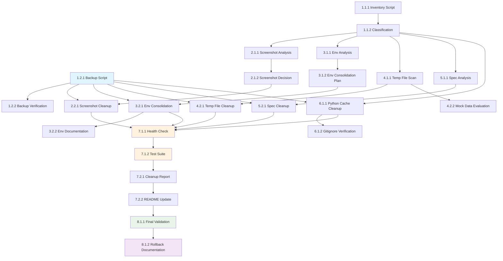

# Tasks: Repository Cleanup

## Phase 1: Analysis and Preparation

### 1.1 Repository Structure Analysis
- **Task 1.1.1**: Create comprehensive file inventory script
  - Agent: Claude
  - Priority: High
  - Dependencies: None
  - Files: scripts/repo-analysis.py
  - Acceptance: Script generates complete inventory with file sizes, categories, and modification dates
  - Requirements: 1.1, 2.1, 3.1, 4.1, 5.1

- **Task 1.1.2**: Implement file classification logic
  - Agent: Claude
  - Priority: High
  - Dependencies: Task 1.1.1
  - Files: scripts/file-classifier.py
  - Acceptance: Classifies files into categories (screenshot, config, temp, mock, spec, cache) with importance levels
  - Requirements: 1.2, 2.2, 3.2, 4.2

### 1.2 Backup Infrastructure
- **Task 1.2.1**: Create backup management script
  - Agent: Claude
  - Priority: High
  - Dependencies: None
  - Files: scripts/backup-manager.py
  - Acceptance: Creates timestamped backups with compression and verification
  - Requirements: 7.1

- **Task 1.2.2**: Implement backup verification system
  - Agent: Claude
  - Priority: Medium
  - Dependencies: Task 1.2.1
  - Files: scripts/backup-verification.py
  - Acceptance: Validates backup integrity and provides restore capabilities
  - Requirements: 7.4

## Phase 2: Screenshot Cleanup

### 2.1 Screenshot Analysis
- **Task 2.1.1**: Analyze screenshot directories for relevance
  - Agent: Droid
  - Priority: Medium
  - Dependencies: Task 1.1.2
  - Files: scripts/screenshot-analyzer.py
  - Acceptance: Identifies which screenshot sets are most recent and complete
  - Requirements: 1.1, 1.2

- **Task 2.1.2**: Create screenshot preservation decision logic
  - Agent: Droid
  - Priority: Medium
  - Dependencies: Task 2.1.1
  - Files: scripts/screenshot-decision.py
  - Acceptance: Determines which screenshots to keep vs remove based on completeness and recency
  - Requirements: 1.3, 1.4

### 2.2 Screenshot Cleanup Execution
- **Task 2.2.1**: Remove obsolete screenshot directories
  - Agent: Droid
  - Priority: Medium
  - Dependencies: Task 2.1.2, Task 1.2.1
  - Files: scripts/cleanup-screenshots.py
  - Acceptance: Removes screenshots-crud-test and old web screenshot directories, preserves most recent set
  - Requirements: 1.3, 1.4

## Phase 3: Environment File Consolidation

### 3.1 Environment File Analysis
- **Task 3.1.1**: Analyze .env file duplications
  - Agent: Claude
  - Priority: High
  - Dependencies: Task 1.1.2
  - Files: scripts/env-analyzer.py
  - Acceptance: Identifies duplicate configurations between root and web directory .env files
  - Requirements: 2.1, 2.2

- **Task 3.1.2**: Create environment consolidation plan
  - Agent: Claude
  - Priority: High
  - Dependencies: Task 3.1.1
  - Files: scripts/env-consolidation.py
  - Acceptance: Generates plan to consolidate .env files while maintaining environment separation
  - Requirements: 2.3, 2.4

### 3.2 Environment File Cleanup
- **Task 3.2.1**: Consolidate .env files
  - Agent: Claude
  - Priority: High
  - Dependencies: Task 3.1.2, Task 1.2.1
  - Files: scripts/consolidate-env.py
  - Acceptance: Moves .env.example to root, maintains separate .env files for different environments
  - Requirements: 2.3, 2.4

- **Task 3.2.2**: Update environment documentation
  - Agent: Claude
  - Priority: Medium
  - Dependencies: Task 3.2.1
  - Files: README.md
  - Acceptance: Documents the new environment file structure and usage patterns
  - Requirements: 2.5

## Phase 4: Temporary File Cleanup

### 4.1 Temporary File Identification
- **Task 4.1.1**: Scan for temporary and debug files
  - Agent: Droid
  - Priority: Medium
  - Dependencies: Task 1.1.2
  - Files: scripts/temp-file-scanner.py
  - Acceptance: Identifies all .log, .tmp, debug-chat-output.txt files and analyzes content importance
  - Requirements: 3.1, 3.2

### 4.2 Temporary File Cleanup
- **Task 4.2.1**: Remove temporary files safely
  - Agent: Droid
  - Priority: Medium
  - Dependencies: Task 4.1.1, Task 1.2.1
  - Files: scripts/cleanup-temp-files.py
  - Acceptance: Removes backend.log and debug-chat-output.txt after verifying no critical information
  - Requirements: 3.3, 3.4

- **Task 4.2.2**: Evaluate mock and replay data necessity
  - Agent: Droid
  - Priority: Low
  - Dependencies: Task 4.1.1
  - Files: scripts/evaluate-mock-data.py
  - Acceptance: Determines if mock and replay files in ./web/public/ are still needed for development
  - Requirements: 3.4

## Phase 5: Spec Document Cleanup

### 5.1 Spec Analysis
- **Task 5.1.1**: Analyze spec document status
  - Agent: Claude
  - Priority: Low
  - Dependencies: Task 1.1.2
  - Files: scripts/spec-analyzer.py
  - Acceptance: Identifies completed, abandoned, or outdated spec projects
  - Requirements: 4.1, 4.2

### 5.2 Spec Cleanup
- **Task 5.2.1**: Archive obsolete spec directories
  - Agent: Claude
  - Priority: Low
  - Dependencies: Task 5.1.1, Task 1.2.1
  - Files: scripts/archive-specs.py
  - Acceptance: Archives or removes specs like deer-flow-analysis-2025-10-17 and completed projects
  - Requirements: 4.3, 4.4

## Phase 6: Cache and Build Artifact Cleanup

### 6.1 Cache File Cleanup
- **Task 6.1.1**: Remove Python cache files
  - Agent: Droid
  - Priority: Medium
  - Dependencies: Task 1.1.2
  - Files: scripts/cleanup-python-cache.py
  - Acceptance: Removes all __pycache__ directories and .coverage files
  - Requirements: 5.3, 5.4

- **Task 6.1.2**: Verify .gitignore coverage
  - Agent: Droid
  - Priority: Low
  - Dependencies: Task 6.1.1
  - Files: .gitignore
  - Acceptance: Ensures .gitignore prevents future cache files from being committed
  - Requirements: 5.5

## Phase 7: Validation and Documentation

### 7.1 Functionality Validation
- **Task 7.1.1**: Create application health check
  - Agent: Claude
  - Priority: High
  - Dependencies: All cleanup tasks
  - Files: scripts/health-check.py
  - Acceptance: Verifies application starts successfully after cleanup
  - Requirements: 7.2

- **Task 7.1.2**: Run comprehensive test suite
  - Agent: Claude
  - Priority: High
  - Dependencies: Task 7.1.1
  - Files: scripts/run-tests.py
  - Acceptance: Executes all existing tests to ensure functionality is preserved
  - Requirements: 7.3

### 7.2 Documentation
- **Task 7.2.1**: Generate cleanup report
  - Agent: Claude
  - Priority: Medium
  - Dependencies: All cleanup tasks
  - Files: CLEANUP_REPORT.md
  - Acceptance: Documents all files removed, space saved, and cleanup process details
  - Requirements: 6.1, 6.2, 6.3

- **Task 7.2.2**: Update README with cleanup guidelines
  - Agent: Claude
  - Priority: Low
  - Dependencies: Task 7.2.1
  - Files: README.md
  - Acceptance: Adds cleanup guidelines and maintenance practices to project documentation
  - Requirements: 6.4

## Phase 8: Final Verification

### 8.1 Final Validation
- **Task 8.1.1**: Perform final repository validation
  - Agent: Claude
  - Priority: High
  - Dependencies: All previous tasks
  - Files: scripts/final-validation.py
  - Acceptance: Confirms repository is in clean state and fully functional
  - Requirements: 7.2, 7.3

- **Task 8.1.2**: Create rollback documentation
  - Agent: Claude
  - Priority: Low
  - Dependencies: Task 8.1.1
  - Files: ROLLBACK_GUIDE.md
  - Acceptance: Documents rollback procedures for future reference
  - Requirements: 7.4

## Task Dependencies Graph

## Total Tasks: 22
**Estimated Time**: 4-6 hours
**Success Metrics**: 
- Repository size reduced by ~10-15MB
- All tests passing after cleanup
- Application starts successfully
- Clean, navigable file structure

## Risk Mitigation
- Full backup created before any deletions
- Validation after each major cleanup phase
- Rollback procedures documented
- Test suite verification throughout process