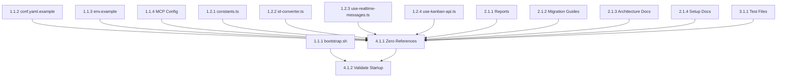

# Tasks: Supabase Cleanup Complete

## Phase 1: Critical Configuration Updates
### 1.1 Environment Configuration
- **Task 1.1.1**: Update bootstrap.sh to remove Supabase validation
  - Agent: Claude
  - Priority: High
  - Dependencies: None
  - Files: bootstrap.sh
  - Acceptance: bootstrap.sh validates Neon/Clerk instead of Supabase
  - Requirements: FR-1, FR-9

- **Task 1.1.2**: Update conf.yaml.example to remove Supabase section
  - Agent: Claude
  - Priority: High
  - Dependencies: None
  - Files: conf.yaml.example
  - Acceptance: SUPABASE section completely removed
  - Requirements: FR-1

- **Task 1.1.3**: Update env.example to replace Supabase with Neon/Clerk
  - Agent: Claude
  - Priority: High
  - Dependencies: None
  - Files: env.example
  - Acceptance: Only Neon/Clerk environment variables present
  - Requirements: FR-1, FR-8

- **Task 1.1.4**: Remove Supabase MCP server configurations
  - Agent: Claude
  - Priority: High
  - Dependencies: None
  - Files: .claude/settings.local.json, web/src/app/(with-sidebar)/chat/settings.json
  - Acceptance: All Supabase MCP references removed
  - Requirements: FR-5

### 1.2 Code Constants and References
- **Task 1.2.1**: Update web/src/lib/constants.ts to remove Supabase references
  - Agent: Claude
  - Priority: High
  - Dependencies: None
  - Files: web/src/lib/constants.ts
  - Acceptance: SUPABASE_QUERY and SUPABASE_URL removed/updated
  - Requirements: FR-4

- **Task 1.2.2**: Update web/src/lib/id-converter.ts comments
  - Agent: Claude
  - Priority: Medium
  - Dependencies: None
  - Files: web/src/lib/id-converter.ts
  - Acceptance: Comments updated to remove Supabase reference
  - Requirements: FR-4

- **Task 1.2.3**: Update web/src/hooks/use-realtime-messages.ts comments
  - Agent: Claude
  - Priority: Medium
  - Dependencies: None
  - Files: web/src/hooks/use-realtime-messages.ts
  - Acceptance: Comments updated to remove Supabase reference
  - Requirements: FR-4

- **Task 1.2.4**: Update web/src/components/jarvis/kanban/hooks/use-kanban-api.ts comments
  - Agent: Claude
  - Priority: Medium
  - Dependencies: None
  - Files: web/src/components/jarvis/kanban/hooks/use-kanban-api.ts
  - Acceptance: Comments about Supabase updated
  - Requirements: FR-4

## Phase 2: Documentation Cleanup
### 2.1 Remove Documentation Files
- **Task 2.1.1**: Delete Supabase reports and validation files
  - Agent: Claude
  - Priority: High
  - Dependencies: None
  - Files: SUPABASE_CLEANUP_REPORT.md, FINAL_MIGRATION_VALIDATION_REPORT.md, FINAL_VALIDATION_REPORT.md, DOCUMENTATION_UPDATE_SUMMARY.md, SUPABASE_INTEGRATION_REPORT.md, SUPABASE_SETUP.md
  - Acceptance: All Supabase report files deleted
  - Requirements: FR-2

- **Task 2.1.2**: Delete migration guide files
  - Agent: Claude
  - Priority: High
  - Dependencies: None
  - Files: PLANO_MIGRACAO_SUPABASE.md, GUIA_MIGRACAO_SUPABASE_CLOUD.md
  - Acceptance: All migration guide files deleted
  - Requirements: FR-2

- **Task 2.1.3**: Delete architecture documentation
  - Agent: Claude
  - Priority: High
  - Dependencies: None
  - Files: docs/SUPABASE_ARCHITECTURE.md, docs/SUPABASE_IMPLEMENTATION_SUMMARY.md
  - Acceptance: All Supabase architecture docs deleted
  - Requirements: FR-2

- **Task 2.1.4**: Delete setup documentation
  - Agent: Claude
  - Priority: High
  - Dependencies: None
  - Files: web/docs/setup/RELATORIO_STATUS_FINAL.md, web/docs/setup/SETUP_COMPLETO_SUPABASE.md
  - Acceptance: All Supabase setup docs deleted
  - Requirements: FR-2

## Phase 3: Test File Cleanup
### 3.1 Remove Supabase Test Files
- **Task 3.1.1**: Delete Supabase-specific test files
  - Agent: Claude
  - Priority: Medium
  - Dependencies: None
  - Files: tests/unit/server/test_dual_auth.py, web/src/hooks/__tests__/use-realtime-messages.test.ts
  - Acceptance: All Supabase test files deleted
  - Requirements: FR-3

## Phase 4: Final Validation
### 4.1 Complete Cleanup Verification
- **Task 4.1.1**: Search and verify zero Supabase references remain
  - Agent: Claude
  - Priority: High
  - Dependencies: All previous tasks
  - Files: Entire codebase
  - Acceptance: Zero Supabase references found in codebase
  - Requirements: All FR requirements

- **Task 4.1.2**: Validate application starts without Supabase references
  - Agent: Claude
  - Priority: High
  - Dependencies: Task 4.1.1
  - Files: Application startup process
  - Acceptance: Application starts successfully with Neon/Clerk only
  - Requirements: All functional requirements

## Dependencies Graph

## Total Tasks: 14
**Estimated Time**: 3-4 hours
**Success Metrics**: Zero Supabase references, application runs with Neon/Clerk only