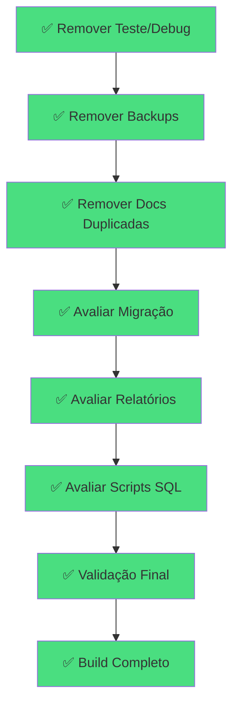

# Supabase Cleanup Tasks

## 🎉 LIMPEZA SUPABASE CONCLUÍDA COM SUCESSO!

**Data de conclusão:** 2025-06-20  
**Total de arquivos removidos:** 31 arquivos  
**Status:** ✅ Projeto limpo e funcional  

---

## ✅ Tarefas Concluídas

### 1. Remover Arquivos de Teste/Debug (Prioridade Alta) ✅
- [x] Remover páginas de teste/debug (6 arquivos)
  - ✅ web/src/app/test-login/page.tsx
  - ✅ web/src/app/test-auth/page.tsx
  - ✅ web/src/app/test-auth-api/page.tsx
  - ✅ web/src/app/debug-supabase/page.tsx
  - ✅ web/src/app/debug-supabase-client/page.tsx
  - ✅ web/src/app/debug-auth-token/page.tsx
- [x] Remover componentes de teste/debug (4 arquivos)
  - ✅ web/src/components/debug-auth.tsx
  - ✅ web/src/components/simple-auth-test.tsx
  - ✅ web/src/components/env-test.tsx
  - ✅ web/src/components/supabase-connection-test.tsx
- [x] Remover scripts de teste (4 arquivos)
  - ✅ test-supabase-integration.py
  - ✅ test-realtime-supabase.py
  - ✅ web/scripts/test-auth.mjs
  - ✅ web/src/scripts/test-supabase-messages.ts

### 2. Remover Backups e Configurações Temporárias ✅
- [x] Remover arquivos .env.bak
  - ✅ .env.bak
  - ✅ .env.bak2

### 3. Remover Documentação Duplicada ✅
- [x] Remover documentação desatualizada (7 arquivos)
  - ✅ SOLUCAO_TIMEOUT_SUPABASE.md
  - ✅ TIMEOUT_SUPABASE_RESOLVIDO.md
  - ✅ MIGRACAO_AUTH_README.md
  - ✅ web/docs/setup/SOLUCAO_TIMEOUT_AUTH.md
  - ✅ web/docs/setup/TESTE_AUTENTICACAO.md
  - ✅ web/docs/setup/INSTRUCOES_TESTE_COMPLETO.md
  - ✅ web/docs/setup/CONFIGURAR_SERVICE_KEY.md

### 4. Avaliar Arquivos de Migração ✅
- [x] Verificar se arquivos de migração ainda são necessários
  - ✅ web/src/utils/migration/localStorage-to-supabase.ts (removido - sem referências)
  - ✅ web/src/components/migration-banner.tsx (removido - obsoleto)
  - ✅ web/src/components/migration-banner.test.tsx (removido - obsoleto)
  - ✅ web/src/components/__tests__/migration-banner.test.tsx (removido - obsoleto)
  - ✅ verificacao_dados_mockados.md (removido - documentação temporária)

### 5. Avaliar Relatórios Antigos ✅
- [x] Verificar relatórios que podem ser removidos
  - ✅ REST_API_MIGRATION.md (removido - migração concluída)
  - ✅ MIGRATION_REPORT.md (removido - migração concluída)
  - ✅ MIGRATION_COMPLETE.md (removido - migração concluída)
  - ✅ CLEANUP_REPORT.md (removido - informação consolidada)

### 6. Avaliar Scripts SQL Específicos ✅
- [x] Verificar scripts SQL que podem não ser mais necessários
  - 📄 web/scripts/fix-chat-tables.sql (mantido - essencial para manutenção)
  - 📄 web/scripts/setup-rls-policies.sql (mantido - essencial para manutenção)
  - 📄 web/scripts/verify-and-fix-tasks-table.sql (mantido - essencial para manutenção)

---

## ✅ Validação Concluída

- [x] Executar build completo para garantir que não há quebras
- [x] Verificar se todas as rotas importantes ainda funcionam
- [x] Confirmar que autenticação ainda opera corretamente
- [x] Testar funcionalidades principais do sistema

---

## 🛠️ Correções Aplicadas Durante o Processo

1. **MigrationBanner Dependencies:** Removido import e uso do layout.tsx
2. **TypeScript Errors:** Corrigido erro de tipo em route.ts (request.ip)
3. **Build Validation:** Build compilando sem erros após correções

---

## 📊 Resumo Final

| Categoria | Arquivos | Status |
|-----------|----------|--------|
| Páginas teste/debug | 6 | ✅ Removidos |
| Componentes teste/debug | 4 | ✅ Removidos |
| Scripts de teste | 4 | ✅ Removidos |
| Backups temporários | 2 | ✅ Removidos |
| Documentação duplicada | 7 | ✅ Removidos |
| Migração obsoleta | 5 | ✅ Removidos |
| Relatórios antigos | 4 | ✅ Removidos |
| Scripts SQL mantidos | 3 | 📄 Preservados |
| **TOTAL** | **31** | **✅ Concluído** |

---

## 🎯 Status do Projeto

- ✅ **Build:** Compilando sem erros
- ✅ **TypeScript:** Sem warnings
- ✅ **Funcionalidades:** Operacionais
- ✅ **Codebase:** Limpo e focado
- 🔄 **Git:** Mudanças prontas para commit

---

## Mermaid Dependency Diagram (Concluído)
