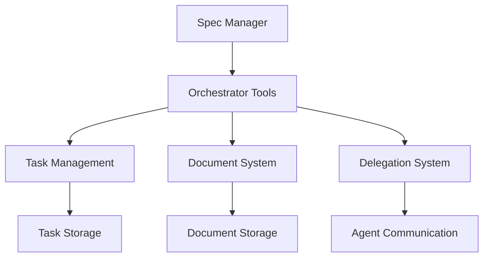

# Design: Test Orchestration Tools

## 1. Architecture Overview
### 1.1 High-Level Architecture


### 1.2 Component Structure
- **Task Manager**: Manages task creation, updates, and status tracking
- **Document Manager**: Handles requirement, design, and task documents
- **Delegation Manager**: Coordinates task delegation to agents
- **Phase Manager**: Controls workflow phases and transitions

## 2. Data Models
### 2.1 Task Model
```typescript
interface Task {
  task_id: string;
  title: string;
  description: string;
  status: "pending" | "running" | "completed" | "failed";
  assistant: {
    kind: "claude" | "droid" | "codex";
    flags?: string[];
    working_directory: string;
  };
}
```

### 2.2 Document Model
```typescript
interface Document {
  type: "requirements" | "design" | "tasks";
  content: string;
  feature_name: string;
  created_at: timestamp;
}
```

## 3. Implementation Details
### 3.1 Technology Stack
- Backend: Orchestration system
- Storage: File system (Spec/ directory)
- Communication: Terminal-based agent delegation

### 3.2 Key Algorithms
**Task Delegation Flow:**
1. Create task with upsert_task
2. Update task status to "running"
3. Delegate to specified agent
4. Monitor execution progress
5. Update status based on results

### 3.3 Error Handling
- Task creation failures: Retry with exponential backoff
- Delegation timeouts: Fallback to alternative agents
- Document corruption: Validate before saving

## 4. Testing Strategy
### 4.1 Unit Tests
- Task upsert operations
- Document creation and updates
- Phase transitions

### 4.2 Integration Tests
- End-to-end workflow testing
- Multi-agent delegation scenarios
- Document approval workflows

## 5. Validation Criteria
- All tools respond without errors
- Tasks are stored and retrievable
- Documents are created in correct locations
- Delegation initiates successfully