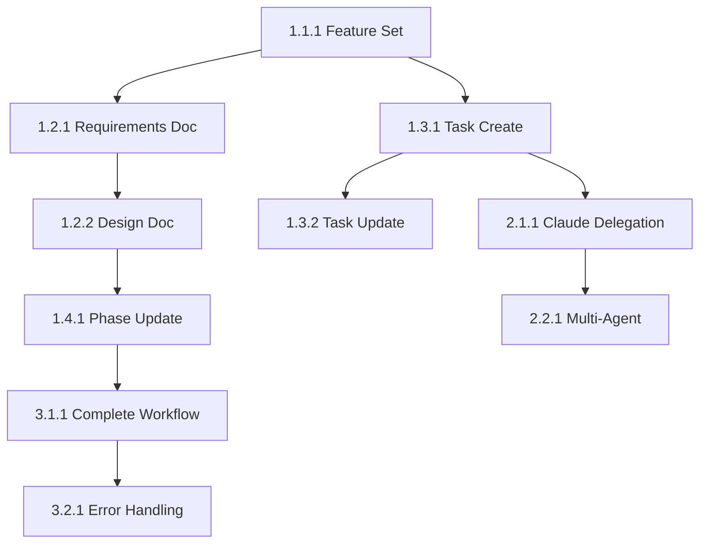

# Tasks: Test Orchestration Tools

## Phase 1: Tool Validation
### 1.1 Feature Management
- **Task 1.1.1**: Test orchestrator_set_feature functionality
  - Agent: Claude
  - Priority: High
  - Dependencies: None
  - Files: N/A
  - Acceptance: Feature name is set correctly and system responds
  - Requirements: FR-1

### 1.2 Document Operations
- **Task 1.2.1**: Test orchestrator_write_document for requirements
  - Agent: Claude
  - Priority: High
  - Dependencies: Task 1.1.1
  - Files: Spec/test-orchestration-tools/requirements.md
  - Acceptance: Requirements document created with correct content and structure
  - Requirements: FR-1, FR-4

- **Task 1.2.2**: Test orchestrator_write_document for design
  - Agent: Claude
  - Priority: High
  - Dependencies: Task 1.2.1
  - Files: Spec/test-orchestration-tools/design.md
  - Acceptance: Design document created with mermaid diagrams and technical details
  - Requirements: FR-1, FR-4

### 1.3 Task Management
- **Task 1.3.1**: Test orchestrator_upsert_task creation
  - Agent: Claude
  - Priority: High
  - Dependencies: None
  - Files: N/A (internal storage)
  - Acceptance: Task created with all fields populated correctly
  - Requirements: FR-2

- **Task 1.3.2**: Test orchestrator_upsert_task updates
  - Agent: Claude
  - Priority: Medium
  - Dependencies: Task 1.3.1
  - Files: N/A (internal storage)
  - Acceptance: Task status and fields update correctly
  - Requirements: FR-2

### 1.4 Phase Management
- **Task 1.4.1**: Test orchestrator_update_phase functionality
  - Agent: Claude
  - Priority: High
  - Dependencies: Task 1.2.2
  - Files: N/A (workflow state)
  - Acceptance: Phase transitions work correctly and are tracked
  - Requirements: FR-1, FR-4

## Phase 2: Delegation Testing
### 2.1 Basic Delegation
- **Task 2.1.1**: Test orchestrator_delegate_task with Claude
  - Agent: Claude
  - Priority: High
  - Dependencies: Task 1.3.1
  - Files: N/A (delegation system)
  - Acceptance: Delegation initiates and returns proper response
  - Requirements: FR-3

### 2.2 Agent Selection
- **Task 2.2.1**: Test delegation to different agents (Droid, Codex)
  - Agent: Droid
  - Priority: Medium
  - Dependencies: Task 2.1.1
  - Files: N/A (agent selection)
  - Acceptance: Different agents can be selected and delegated to
  - Requirements: FR-3

## Phase 3: Integration Testing
### 3.1 Workflow Integration
- **Task 3.1.1**: Test complete spec workflow from requirements to tasks
  - Agent: Claude
  - Priority: High
  - Dependencies: All Phase 1 and 2 tasks
  - Files: Spec/test-orchestration-tools/
  - Acceptance: Complete workflow executes without errors
  - Requirements: FR-1, FR-2, FR-3, FR-4

### 3.2 Error Handling
- **Task 3.2.1**: Test error scenarios and recovery
  - Agent: Claude
  - Priority: Medium
  - Dependencies: Task 3.1.1
  - Files: N/A (error handling)
  - Acceptance: System handles errors gracefully and provides feedback
  - Requirements: All FRs

## Dependencies Graph

## Total Tasks: 10
**Estimated Time**: 2 hours
**Success Metrics**: All orchestration tools function correctly for production use