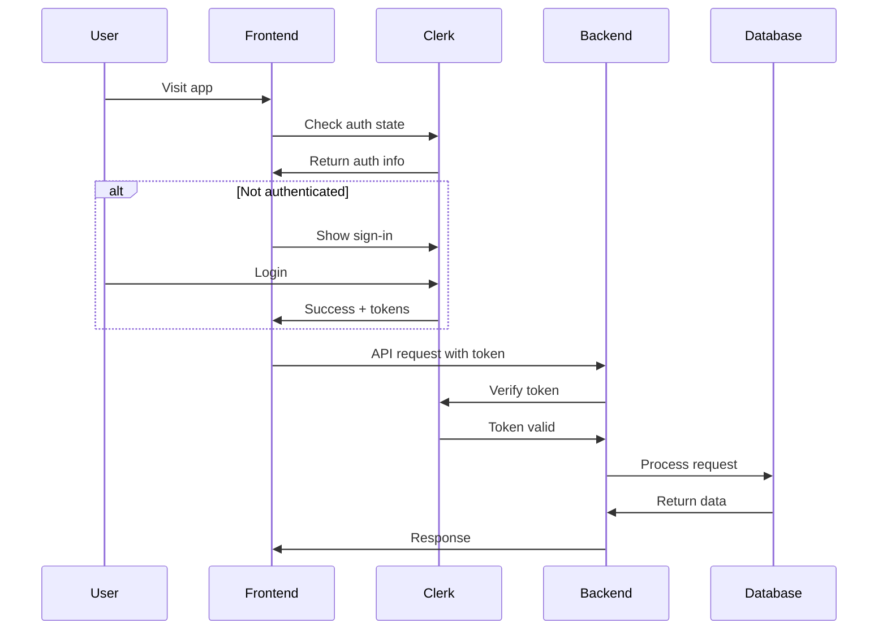
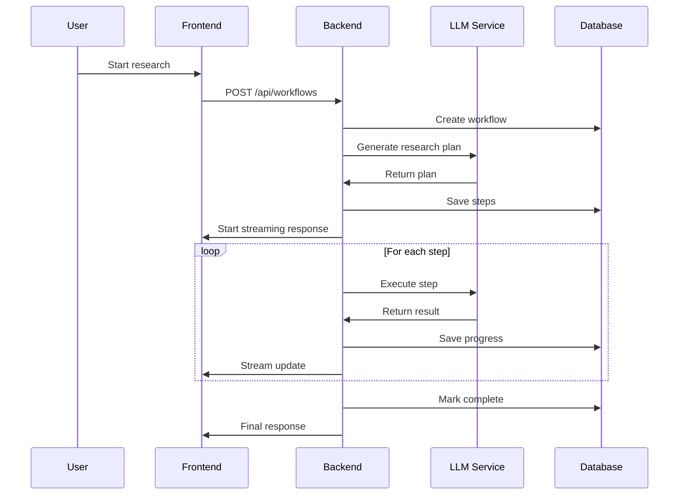

# Neon + Clerk Architecture Documentation

## 🏗️ Overview

DeerFlow has been completely refactored to use **Neon PostgreSQL** as the database and **Clerk** as the authentication provider. This migration provides enhanced scalability, security, and developer experience compared to the previous Supabase-based architecture.

## 📊 Architecture Diagram

```
┌─────────────────┐    ┌─────────────────┐    ┌─────────────────┐
│   Frontend      │    │   Backend       │    │   Database      │
│   (Next.js)     │◄──►│   (FastAPI)     │◄──►│   (Neon PG)     │
│                 │    │                 │    │                 │
│ • Clerk Auth    │    │ • REST API      │    │ • Serverless    │
│ • React UI      │    │ • LLM Integration│   │ • Auto-scaling  │
│ • TypeScript    │    │ • Tool Execution│   │ • Real-time     │
└─────────────────┘    └─────────────────┘    └─────────────────┘
         │                       │                       │
         │                       │                       │
         └───────────────────────┼───────────────────────┘
                                 │
                    ┌─────────────────┐
                    │   Clerk Auth    │
                    │   Service       │
                    │                 │
                    │ • User Mgmt     │
                    │ • Sessions      │
                    │ • Webhooks      │
                    └─────────────────┘
```

## 🗄️ Database Layer (Neon PostgreSQL)

### Why Neon?

- **Serverless**: Auto-scaling PostgreSQL with pay-per-use pricing
- **Branching**: Development and testing branches like Git
- **Real-time**: Built-in real-time subscriptions
- **Performance**: Optimized for modern applications
- **Security**: Enterprise-grade security with VPC integration

### Database Schema

The database schema has been optimized for Neon's capabilities:

```sql
-- Core tables
users                    -- User profiles (synced from Clerk)
workflows               -- Research workflows
workflow_steps          -- Individual workflow steps
workflow_messages       -- Chat messages and responses
workflow_executions     -- Execution history and status

-- Jarvis features
health_metrics          -- Health tracking data
calendar_events         -- Calendar and events
notes                   -- User notes
tasks                   -- Task management
reminders               -- Reminder system

-- System tables
api_keys               -- API key management
audit_logs             -- Audit trail
system_settings        -- Configuration
```

### Connection Management

```python
# SQLAlchemy configuration for Neon
engine = create_async_engine(
    DATABASE_URL,
    pool_size=20,
    max_overflow=10,
    pool_timeout=30,
    pool_recycle=3600,
    pool_pre_ping=True,
    echo=settings.DEBUG
)
```

### Migration Strategy

- **Alembic**: Database versioning and migrations
- **Branching**: Development branches for safe testing
- **Backup**: Automated backups with point-in-time recovery

## 🔐 Authentication Layer (Clerk)

### Why Clerk?

- **Modern**: Built for modern web applications
- **Comprehensive**: Complete auth solution out of the box
- **Secure**: Enterprise-grade security
- **Flexible**: Multiple auth methods and providers
- **Developer Experience**: Excellent DX with SDKs and components

### Authentication Flow

```
1. User visits app → Clerk detects auth state
2. Login/Signup → Clerk handles authentication
3. Session created → JWT tokens issued
4. Backend request → Clerk middleware validates
5. User data sync → Clerk webhook updates database
```

### Clerk Integration

#### Frontend (Next.js)

```typescript
// Clerk provider setup
import { ClerkProvider } from '@clerk/nextjs'

function App({ children }) {
  return (
    <ClerkProvider publishableKey={process.env.NEXT_PUBLIC_CLERK_PUBLISHABLE_KEY}>
      {children}
    </ClerkProvider>
  )
}

// Auth hooks
import { useUser, useAuth } from '@clerk/nextjs'

function UserProfile() {
  const { user } = useUser()
  const { userId } = useAuth()
  
  return <div>Welcome, {user?.firstName}</div>
}
```

#### Backend (FastAPI)

```python
# Clerk authentication middleware
from src.server.clerk_auth import get_current_user, verify_clerk_token

@app.get("/api/user/profile")
async def get_user_profile(current_user: User = Depends(get_current_user)):
    return {"user": current_user}

# Webhook handler
@app.post("/api/webhooks/clerk")
async def clerk_webhook(request: Request):
    event = await verify_clerk_webhook(request)
    await handle_clerk_event(event)
```

### User Synchronization

```python
# Automatic user sync from Clerk webhooks
async def handle_user_created(user_data: dict):
    user = User(
        id=user_data["id"],
        email=user_data["email_addresses"][0]["email_address"],
        username=user_data["username"],
        first_name=user_data.get("first_name"),
        last_name=user_data.get("last_name"),
        profile_image_url=user_data.get("profile_image_url"),
        created_at=datetime.fromisoformat(user_data["created_at"]),
        updated_at=datetime.fromisoformat(user_data["updated_at"])
    )
    await db.merge(user)
    await db.commit()
```

## 🚀 API Layer (FastAPI)

### Architecture

- **Async**: Fully async for better performance
- **Type Safety**: Full TypeScript/Python type safety
- **Validation**: Pydantic models for request/response validation
- **Documentation**: Auto-generated OpenAPI docs
- **Middleware**: Authentication, CORS, logging, rate limiting

### API Structure

```
/api/
├── auth/              # Authentication endpoints
├── workflows/         # Workflow management
├── chat/             # Chat and messaging
├── jarvis/           # Jarvis assistant features
│   ├── health/       # Health tracking
│   ├── calendar/     # Calendar events
│   ├── notes/        # Notes management
│   ├── tasks/        # Task management
│   └── reminders/    # Reminder system
├── admin/            # Admin endpoints
└── webhooks/         # Webhook handlers
```

### Error Handling

```python
# Centralized error handling
@app.exception_handler(AuthenticationError)
async def auth_exception_handler(request: Request, exc: AuthenticationError):
    return JSONResponse(
        status_code=401,
        content={"detail": "Authentication failed"}
    )

@app.exception_handler(DatabaseError)
async def db_exception_handler(request: Request, exc: DatabaseError):
    logger.error(f"Database error: {exc}")
    return JSONResponse(
        status_code=500,
        content={"detail": "Internal server error"}
    )
```

## 🎨 Frontend Layer (Next.js)

### Technology Stack

- **Next.js 14**: React framework with App Router
- **TypeScript**: Type-safe development
- **Tailwind CSS**: Utility-first styling
- **Clerk**: Authentication and user management
- **React Query**: Server state management
- **Zustand**: Client state management

### Component Architecture

```
src/
├── app/                    # Next.js App Router
│   ├── (auth)/            # Auth routes
│   ├── (with-sidebar)/    # Main app with sidebar
│   ├── api/               # API routes
│   └── globals.css        # Global styles
├── components/            # Reusable components
│   ├── ui/               # Base UI components
│   ├── deer-flow/        # DeerFlow specific
│   └── jarvis/           # Jarvis assistant
├── core/                 # Core functionality
│   ├── api/              # API client
│   ├── contexts/         # React contexts
│   └── utils/            # Utility functions
├── hooks/                # Custom React hooks
├── lib/                  # Libraries and configurations
└── services/             # External service integrations
```

### State Management

```typescript
// React Query for server state
import { useQuery, useMutation, useQueryClient } from '@tanstack/react-query'

function useUserProfile() {
  return useQuery({
    queryKey: ['user', 'profile'],
    queryFn: () => api.get('/api/user/profile'),
    staleTime: 5 * 60 * 1000, // 5 minutes
  })
}

// Zustand for client state
import { create } from 'zustand'

interface AppStore {
  sidebarOpen: boolean
  theme: 'light' | 'dark'
  setSidebarOpen: (open: boolean) => void
  setTheme: (theme: 'light' | 'dark') => void
}

const useAppStore = create<AppStore>((set) => ({
  sidebarOpen: true,
  theme: 'light',
  setSidebarOpen: (open) => set({ sidebarOpen: open }),
  setTheme: (theme) => set({ theme }),
}))
```

## 🔄 Data Flow

### Authentication Flow



### Workflow Execution Flow



## 🔒 Security Model

### Authentication Security

- **JWT Tokens**: Short-lived access tokens
- **Session Management**: Secure session handling
- **Multi-factor**: Optional MFA support
- **Social Providers**: Google, GitHub, etc.
- **Webhook Security**: Signed webhook verification

### Data Security

- **Encryption**: TLS 1.3 for all connections
- **Database Security**: Row-level security
- **API Security**: Rate limiting and input validation
- **Environment Variables**: Secure secret management
- **Audit Logging**: Complete audit trail

### Example Security Implementation

```python
# Secure API endpoint
@app.post("/api/workflows")
async def create_workflow(
    workflow_data: WorkflowCreate,
    current_user: User = Depends(get_current_user),
    db: AsyncSession = Depends(get_db)
):
    # Input validation
    validated_data = validate_workflow_input(workflow_data)
    
    # Authorization check
    if not current_user.can_create_workflows:
        raise HTTPException(403, "Insufficient permissions")
    
    # Create workflow
    workflow = Workflow(
        user_id=current_user.id,
        **validated_data.dict()
    )
    db.add(workflow)
    await db.commit()
    
    # Audit log
    await log_audit_event(
        user_id=current_user.id,
        action="create_workflow",
        resource_id=workflow.id
    )
    
    return workflow
```

## 📈 Performance Optimization

### Database Optimization

- **Connection Pooling**: Efficient connection management
- **Indexing**: Optimized queries with proper indexes
- **Caching**: Redis caching for frequent queries
- **Read Replicas**: Read scaling for better performance

### API Optimization

- **Async Operations**: Non-blocking I/O throughout
- **Response Compression**: Gzip compression for responses
- **Rate Limiting**: Prevent abuse and ensure fairness
- **CDN Integration**: Static asset delivery

### Frontend Optimization

- **Code Splitting**: Lazy loading of components
- **Image Optimization**: Next.js Image component
- **Bundle Analysis**: Optimized bundle sizes
- **Caching Strategy**: Effective browser caching

## 🧪 Testing Strategy

### Backend Testing

```python
# Integration tests
async def test_workflow_creation():
    # Test user authentication
    user = await create_test_user()
    token = await get_auth_token(user)
    
    # Test workflow creation
    response = client.post(
        "/api/workflows",
        json={"query": "test query"},
        headers={"Authorization": f"Bearer {token}"}
    )
    assert response.status_code == 201
    
    # Verify database state
    workflow = await db.get(Workflow, response.json()["id"])
    assert workflow.user_id == user.id
```

### Frontend Testing

```typescript
// Component tests
import { render, screen, waitFor } from '@testing-library/react'
import { UserProfile } from '@/components/user-profile'

test('displays user information', async () => {
  const mockUser = { id: '1', firstName: 'John', email: 'john@example.com' }
  
  render(<UserProfile user={mockUser} />)
  
  expect(screen.getByText('Welcome, John')).toBeInTheDocument()
  expect(screen.getByText('john@example.com')).toBeInTheDocument()
})
```

## 🚀 Deployment Architecture

### Production Deployment

```yaml
# Docker Compose for production
version: '3.8'
services:
  frontend:
    image: deer-flow-frontend:latest
    ports:
      - "3000:3000"
    environment:
      - NEXT_PUBLIC_CLERK_PUBLISHABLE_KEY=${CLERK_PUBLISHABLE_KEY}
      - NEXT_PUBLIC_API_URL=${API_URL}
  
  backend:
    image: deer-flow-backend:latest
    ports:
      - "8005:8005"
    environment:
      - DATABASE_URL=${DATABASE_URL}
      - CLERK_SECRET_KEY=${CLERK_SECRET_KEY}
      - JWT_SECRET_KEY=${JWT_SECRET_KEY}
    depends_on:
      - redis
  
  redis:
    image: redis:7-alpine
    ports:
      - "6379:6379"
```

### Environment Configuration

- **Development**: Local Neon branch + Clerk test keys
- **Staging**: Staging Neon branch + Clerk staging keys
- **Production**: Production Neon + Clerk production keys

## 🔍 Monitoring & Observability

### Application Monitoring

- **Health Checks**: Comprehensive health endpoints
- **Metrics**: Prometheus metrics collection
- **Logging**: Structured logging with correlation IDs
- **Error Tracking**: Sentry integration for error monitoring

### Database Monitoring

- **Query Performance**: Slow query monitoring
- **Connection Metrics**: Pool usage and health
- **Resource Usage**: CPU, memory, and storage metrics
- **Backup Status**: Automated backup monitoring

### Example Monitoring Implementation

```python
# Health check endpoint
@app.get("/api/health")
async def health_check():
    checks = {
        "database": await check_database_health(),
        "redis": await check_redis_health(),
        "clerk": await check_clerk_health(),
        "llm": await check_llm_health()
    }
    
    status = "healthy" if all(checks.values()) else "unhealthy"
    return {
        "status": status,
        "checks": checks,
        "timestamp": datetime.utcnow().isoformat()
    }
```

## 📚 Migration Guide

### From Supabase to Neon

1. **Database Migration**
   ```bash
   # Export from Supabase
   pg_dump $SUPABASE_URL > supabase_dump.sql
   
   # Import to Neon
   psql $NEON_DATABASE_URL < supabase_dump.sql
   ```

2. **Authentication Migration**
   - Export user data from Supabase Auth
   - Import to Clerk (if possible) or require re-registration
   - Update authentication logic

3. **API Updates**
   - Replace Supabase client with Clerk authentication
   - Update database queries to use SQLAlchemy
   - Update environment variables

4. **Frontend Updates**
   - Replace Supabase Auth components with Clerk
   - Update API client authentication
   - Update state management

### Key Differences

| Aspect | Supabase | Neon + Clerk |
|--------|----------|--------------|
| Database | PostgreSQL with real-time | Serverless PostgreSQL |
| Auth | Built-in auth service | Dedicated auth service |
| Real-time | Built-in subscriptions | Neon real-time + custom |
| Storage | Built-in file storage | External storage needed |
| Edge Functions | Built-in functions | Custom API layer |
| Pricing | All-in-one | Separate services |

## 🎯 Best Practices

### Development Practices

1. **Environment Management**
   - Use Neon branches for development
   - Separate Clerk applications for each environment
   - Environment-specific configuration

2. **Code Organization**
   - Separate business logic from infrastructure
   - Use dependency injection
   - Implement proper error handling

3. **Security Practices**
   - Validate all inputs
   - Use parameterized queries
   - Implement proper authentication checks
   - Log security events

### Performance Practices

1. **Database Optimization**
   - Use connection pooling
   - Implement proper indexing
   - Cache frequently accessed data
   - Monitor query performance

2. **API Optimization**
   - Use async/await consistently
   - Implement proper pagination
   - Compress responses
   - Use appropriate HTTP methods

3. **Frontend Optimization**
   - Implement lazy loading
   - Optimize bundle sizes
   - Use appropriate caching strategies
   - Monitor Core Web Vitals

## 🔧 Troubleshooting

### Common Issues

1. **Database Connection Issues**
   - Check connection string format
   - Verify SSL configuration
   - Check network connectivity
   - Monitor connection pool status

2. **Authentication Issues**
   - Verify Clerk configuration
   - Check webhook URLs
   - Validate JWT tokens
   - Review user sync status

3. **Performance Issues**
   - Monitor database query times
   - Check connection pool usage
   - Review API response times
   - Analyze frontend bundle sizes

### Debug Tools

- **Neon Console**: Database monitoring and management
- **Clerk Dashboard**: User management and authentication
- **Application Logs**: Structured logging with correlation IDs
- **Health Endpoints**: Real-time system status

This architecture provides a solid foundation for DeerFlow's growth and scalability while maintaining security and performance standards.
