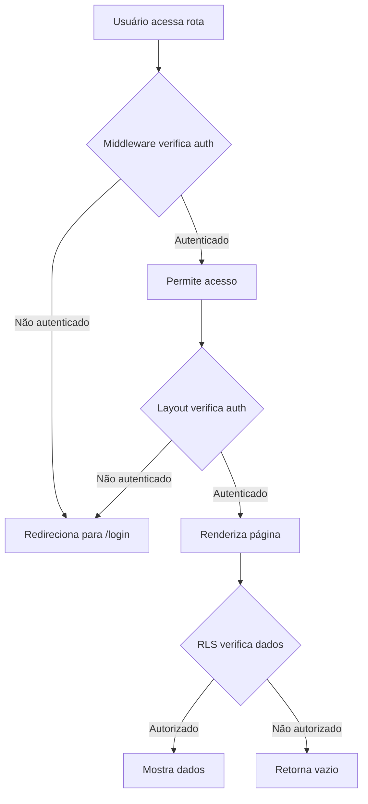

# 🔐 Sistema de Autenticação DeerFlow

## Visão Geral

O DeerFlow agora possui um sistema completo de autenticação e autorização implementado em múltiplas camadas:

1. **Middleware (Server-side)**: Protege rotas no servidor
2. **Layout Protection (Client-side)**: Protege componentes no cliente
3. **RLS (Row Level Security)**: Protege dados no banco de dados

## 🛡️ Camadas de Proteção

### 1. Middleware de Autenticação (`src/middleware.ts`)

O middleware intercepta TODAS as requisições e:
- Verifica se o usuário está autenticado usando cookies do Supabase
- Redireciona para `/login` se não autenticado
- Permite acesso apenas a rotas públicas: `/`, `/login`, `/register`
- Redireciona usuários autenticados de `/login` para `/dashboard`

### 2. Proteção no Layout (`src/app/(with-sidebar)/layout.tsx`)

O layout das rotas protegidas:
- Verifica autenticação no cliente
- Mostra loading enquanto verifica
- Redireciona para login se não autenticado
- Renderiza conteúdo apenas para usuários autenticados

### 3. Políticas RLS no Supabase

Todas as tabelas têm RLS habilitado:
- **conversations**: Usuários só veem suas próprias conversas
- **messages**: Usuários só veem mensagens de suas conversas
- **notes**: Usuários só veem suas próprias notas
- **projects/tasks**: Usuários só veem seus próprios projetos
- **calendar_events**: Usuários só veem seus próprios eventos
- **health_data**: Usuários só veem seus próprios dados

## 🚀 Como Configurar

### 1. Execute as Políticas RLS no Supabase

```bash
# No Supabase Dashboard:
# 1. Vá para SQL Editor
# 2. Cole e execute o conteúdo de:
scripts/setup-rls-policies.sql
```

### 2. Verifique as Variáveis de Ambiente

```env
NEXT_PUBLIC_SUPABASE_URL=sua_url_aqui
NEXT_PUBLIC_SUPABASE_ANON_KEY=sua_chave_aqui
```

### 3. Teste o Sistema

1. Tente acessar `/chat` sem estar logado → Deve redirecionar para `/login`
2. Faça login → Deve redirecionar para `/dashboard`
3. Tente acessar dados de outro usuário → Deve retornar vazio

## 🔄 Fluxo de Autenticação



## ⚠️ Problemas Comuns

### "Consigo acessar sem login"
- **Causa**: Middleware não está rodando
- **Solução**: Reinicie o servidor Next.js

### "Vejo dados de outros usuários"
- **Causa**: RLS não está habilitado
- **Solução**: Execute o script SQL de políticas

### "Não consigo fazer login"
- **Causa**: Credenciais incorretas ou usuário não existe
- **Solução**: Verifique email/senha ou crie conta em `/register`

### "Sou deslogado constantemente"
- **Causa**: Token expirado ou cookies bloqueados
- **Solução**: Verifique configurações de cookies do navegador

## 🔧 Debug

Para debugar problemas de autenticação:

```javascript
// No console do navegador:
const supabase = (await import('./src/lib/supabase/client')).getSupabaseClient()
const { data: { session } } = await supabase.auth.getSession()
console.log('Session:', session)
console.log('User:', session?.user)
console.log('Token expira em:', new Date(session?.expires_at * 1000))
```

## 📝 Checklist de Segurança

- [x] Middleware protege todas as rotas
- [x] Layout verifica autenticação no cliente
- [x] RLS habilitado em todas as tabelas
- [x] Políticas criadas para cada operação CRUD
- [x] Redirecionamento após login funciona
- [x] Sessões expiradas são tratadas
- [x] Dados isolados por usuário

## 🚨 IMPORTANTE

**NUNCA** desabilite essas proteções em produção! O sistema foi projetado para garantir que:

1. Usuários não autenticados não acessem rotas privadas
2. Usuários autenticados só vejam seus próprios dados
3. Tentativas de acesso não autorizado sejam bloqueadas em múltiplas camadas

Se precisar de ajuda ou encontrar problemas, verifique este documento primeiro!